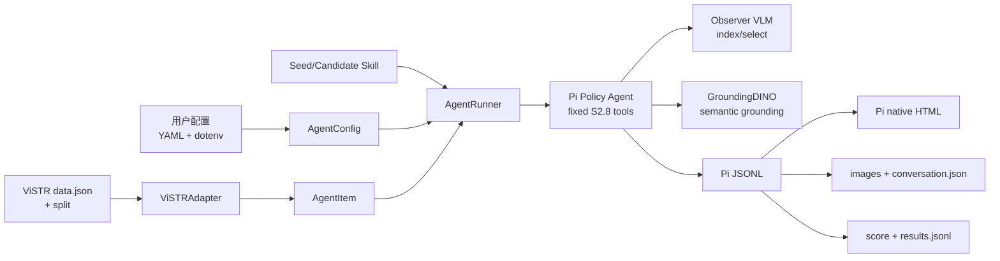

# 4D-Agent

4D-Agent 是面向 [ViSTR-Bench](https://arxiv.org/abs/2607.20868) 的工具增强视频时空推理系统。当前受支持的主线是 **S2.8 configurable runtime**：Policy VLM 通过 Pi agent loop 自主选择观察工具，辅助 Observer VLM 负责粗粒度视频索引和语义区域选择，GroundingDINO 提供开放词汇定位。

当前实现只用于 ViSTR-Bench Public 数据上的开发和评测；不要用 private held-out 数据调参。

## 当前设计



运行过程如下：

1. `AgentConfig.from_yaml()` 严格解析 YAML 和它指定的 dotenv。
2. `ViSTRAdapter` 将 benchmark 记录标准化成通用 `AgentItem`。
3. `AgentRunner` 创建隔离的 Pi 模型配置，复用或启动 GroundingDINO，并为每道题创建临时 workspace。
4. Pi Policy Agent 在固定工具集合中自主观察视频，最后输出 `<answer>exact option text</answer>`。
5. Runtime 解析答案和工具轨迹，与 gold answer 评分，并为每个 attempt 导出原生 Pi JSONL/HTML、图片和反思用 conversation。

## 封装了什么

使用者不需要直接管理以下内部细节：

- Pi `models.json` 的生成和临时目录；provider credentials 只写入权限为 `0600` 的临时配置。
- Policy/Observer credential 注入和从模型可调用 `bash` 环境中移除 secret。
- 固定 S2.8 Tool Bundle 的注册、扩展加载和 allowlist。
- 每题临时 workspace、`video.mp4` 准备、并发执行、attempt retry 和 timeout。
- GroundingDINO `/health` 检查、managed/eager 启动、复用和 owned-process 清理。
- Pi JSON event 解析、`<answer>` 提取、tool call/result 统计和二选一评分。
- Run manifest/hash resume、每条 Pi session 的原生 HTML export、图片解码和 SkillOpt-facing conversation 构造。

旧的 V4 planner/executor、S2.5 ledger 和 S2.6/S2.7 closure 代码仍作为历史实现保留，但不属于当前 runtime 的默认执行路径。

## 对外暴露什么

稳定的 Python 接口只有：

```python
from agent.runtime import AgentConfig, AgentItem, AgentRunner, RolloutRecord
from agent.datasets import ViSTRAdapter
```

- `AgentConfig.from_yaml(path)`：加载并验证部署配置。
- `ViSTRAdapter(config.dataset).load(...)`：按 split、task 或 ID 选择题目。
- `AgentRunner(config)`：管理服务生命周期并执行 rollout，必须放在 `with` 中使用。
- `AgentRunner.rollout(items, skill_content=..., run_id=...)`：唯一的批量执行入口。
- `skill_content`：预留给 SkillOpt 的主要可进化面。传 `None` 时读取 YAML 中的 seed Skill；传字符串时使用候选 Skill。
- `RolloutRecord`：返回预测、分数、模型、termination、usage、工具统计和轨迹路径。

工具实现、Pi 命令构造、Observer 子调用、Perception Service 和轨迹物化均封装在 runtime 内，不需要 SkillOpt 或普通调用方直接操作。

## 固定工具集合

当前 `s2_8_observation` Tool Bundle 固定包含九个工具：

| 工具 | 作用 |
|---|---|
| `read` | 直接查看抽出的 JPG/PNG 图片 |
| `bash` | 使用 ffmpeg、ffprobe、cv2/numpy 等做确定性分析 |
| `edit` / `write` | 在单题临时 workspace 中生成分析脚本或文件 |
| `index_video` | Observer 对均匀采样帧生成纯文本粗时间线 |
| `read_video_sequence` | 将连续时间段的有序多帧直接送入 Policy 上下文 |
| `read_multiframe` | 联合查看若干指定时间点 |
| `read_crop` | 按 0–1000 bbox 查看单帧区域或视频段区域 |
| `semantic_crop` | GroundingDINO 定位英文目标，并返回保留上下文的 crop |

图像型 tool result 会直接进入下一轮 Policy 模型上下文，同时也保存在 Pi session；不是只写文件后等待模型再次 `read`。

## 使用前需要自定义什么

### 1. 填写 dotenv

复制模板并限制权限：

```bash
cp .env.example .env
chmod 600 .env
```

默认 DeepSeek 配置需要：

```dotenv
POLICY_API_BASE_URL=https://api.deepseek.com
POLICY_API_KEY=<your DeepSeek API key>
PERCEPTION_URL=http://127.0.0.1:7876
```

真实 `.env` 不会进入 Git。OpenRouter、私有 headers，以及 Policy/Observer 分离配置见 [完整 YAML 字段和 provider 配方](configs/agent/README.md)。

### 2. 检查 YAML

默认配置位于 [configs/agent/s2_8.yaml](configs/agent/s2_8.yaml)，当前选择 DeepSeek Vision Exp。至少需要确认：

- `providers`：API adapter 及其 dotenv 变量名。
- `models.policy` / `models.observer`：provider、精确模型 ID、context window 和单轮输出上限。
- `agent.pi_binary` / `tool_python` / `path_prepend`：本机可执行文件和工具环境。
- `perception.python` / `model_path` / `visible_devices`：GroundingDINO 环境、权重目录和 GPU。
- `dataset.root` / `split_config`：ViSTR-Bench Public 数据与 split 文件。
- `artifacts.trajectory_root`：轨迹输出根目录。
- `agent.workers` / `timeout_s` / `max_attempts`：并发、单 attempt 超时和重试次数。第一次 smoke 建议 `workers: 1`。

所有相对路径都以 YAML 文件目录为基准。完整逐字段说明见 [configs/agent/README.md](configs/agent/README.md)。

### 3. 准备数据和 GroundingDINO

默认路径应满足：

```text
data/benchmarks/ViSTR-Bench-Public/data.json
configs/split.json
models/grounding-dino-base/
```

`perception.mode: managed` 时，runner 会在 `PERCEPTION_URL` 不健康时启动服务。如果已提前部署同一个服务，runner 会复用它，且退出时不会停止外部进程。

## 配置预检

以下命令不会调用 API 或加载 GPU：

```bash
/opt/conda/bin/python - <<'PY'
from agent.runtime import AgentConfig

config = AgentConfig.from_yaml("configs/agent/s2_8.yaml")
print("Policy:", config.policy.provider, config.policy.id)
print("Observer:", config.observer.provider, config.observer.id)
print("Dataset:", config.dataset.root)
print("Trajectories:", config.artifacts.trajectory_root)
PY
```

## 运行 ViSTR-Bench 单题

下面示例运行 Public dev split 的 ID 1。它会调用真实模型 API，并可能启动 GPU Perception Service：

```python
import json

from agent.datasets import ViSTRAdapter
from agent.runtime import AgentConfig, AgentRunner

config = AgentConfig.from_yaml("configs/agent/s2_8.yaml")
items = ViSTRAdapter(config.dataset).load(split="dev", ids=["1"])
assert len(items) == 1

with AgentRunner(config) as runner:
    records = runner.rollout(
        items,
        skill_content=None,
        run_id="s28-id1-v1",
    )

print(json.dumps(records[0].to_dict(), ensure_ascii=False, indent=2))
```

选择接口支持：

```python
adapter.load(split="dev", ids=["1"])
adapter.load(split="dev", tasks=["Basketball_Shot"], limit=5)
adapter.load(split="dev", per_task=1)
adapter.load(split="all", ids=["6"])
```

选择顺序是 `split → tasks → ids → per_task → limit`。`split="all"` 仍然只读取本地 Public 670 题。相同 `run_id` 和相同配置/Skill 会 resume 已完成 item；想重新执行应使用新 `run_id`。

## 轨迹输出

```text
outputs/trajectories/<run_id>/
├── manifest.json
├── results.jsonl
└── <item_id>/attempt-N/
    ├── <session>.jsonl
    ├── <session>.html
    ├── skill.md
    ├── target_user_prompt.txt
    ├── conversation.json
    └── images/
```

- `manifest.json`：非敏感配置 hash、Skill hash、模型、工具包和 Pi 版本，用于安全 resume。
- `results.jsonl`：逐题 `RolloutRecord`。
- Pi JSONL/HTML：完整原生轨迹；每条 session 都会渲染 HTML。
- `conversation.json`：紧凑的消息、工具、图片相对路径和最终评分，供后续 SkillOpt/reflection 使用。

## 离线验证

```bash
/opt/conda/bin/python agent/tests/test_runtime.py
/opt/conda/bin/python agent/tests/test_eval_pi_parse.py
node agent/pi_ext/tests/run.mjs
```

这些测试使用 fake Pi、stubbed provider/perception 和本地 ffmpeg 测试视频，不调用真实 VLM 或 GPU。

## 进一步阅读

- [Runtime 使用说明](docs/agent/configurable_runtime.md)
- [完整配置字段与 DeepSeek/OpenRouter 配方](configs/agent/README.md)
- [架构 code map](docs/code_maps/systems/configurable_agent_runtime.md)
- [S2.8 observation stack](docs/code_maps/systems/pi_observation_stack.md)
- [架构决策记录](docs/adr/2026-09-05_configurable_s28_runtime.md)
- [当前工作状态](docs/working_logs/active.md)

S2.8 方法在既有 403 题 public dev 运行中达到 60.8% micro / 61.1% macro；该数字是方法历史结果，不代表任意新 provider/model 配置都会复现同样表现。
