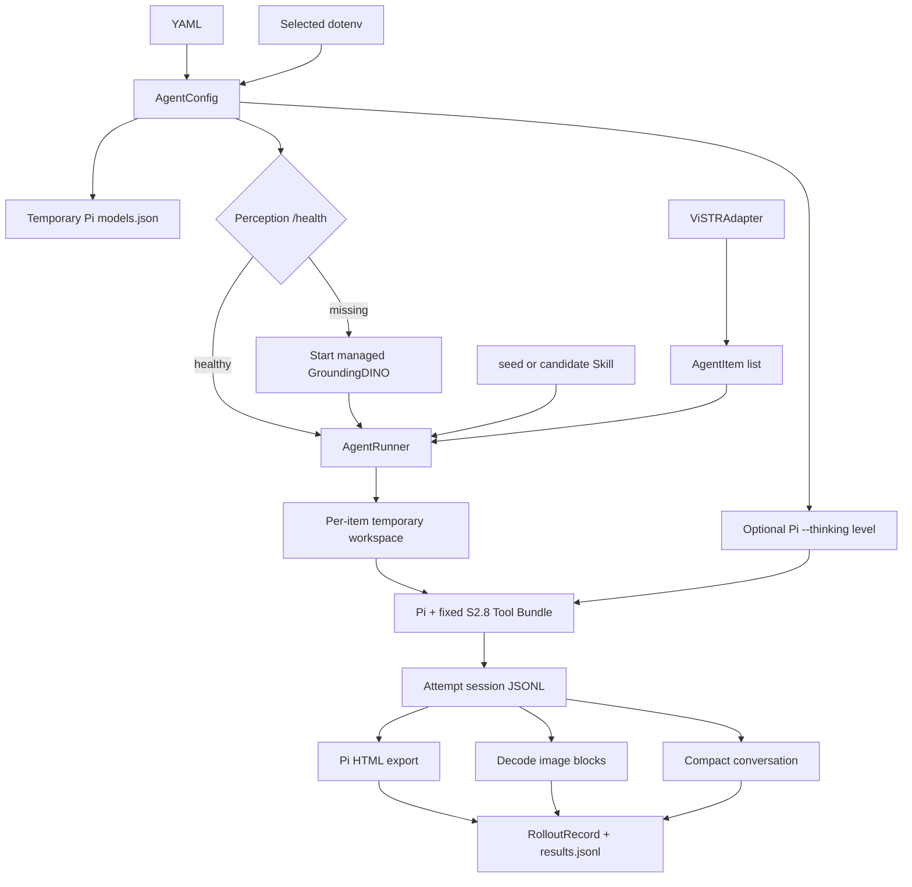

# Configurable S2.8 Agent Runtime

## Purpose

Runs the fixed S2.8 Pi observation agent from a self-contained YAML/dotenv configuration and persists every attempt in both native and reflection-friendly forms.

## Flow Diagram



## Core Pseudocode

```text
config = parse_yaml_and_selected_dotenv()
with AgentRunner(config):
    reuse_or_start_perception()
    generate_temporary_pi_model_config()
    for item in items concurrently:
        for configured attempt:
            run Pi with fixed tools, session directory, Skill, and configured thinking level
            parse answer and tool trace
            export every session to HTML
            decode session images and write conversation.json
            stop retrying after a successful Pi exit
        score final answer and append RolloutRecord
    stop only the perception process owned by this runner
```

## Code Pointers

| Symbol | Path | Role |
|--------|------|------|
| `AgentConfig.from_yaml` | `agent/runtime/config.py` | Strict YAML/dotenv parsing and preflight validation |
| `AgentRunner` | `agent/runtime/runner.py` | Provider setup, service lifetime, concurrency, retries, scoring, resume |
| `export_and_materialize` | `agent/runtime/artifacts.py` | Pi HTML export, image decoding, conversation creation |
| `parse_pi_json` | `agent/runtime/pi_events.py` | Pi event stream and tool trace parsing |
| `get_tool_bundle` | `agent/runtime/tool_bundles.py` | Closed S2.8 tool allowlist and extension mapping |
| `ViSTRAdapter` | `agent/datasets/vistr.py` | Benchmark records to Agent Items |
| `gatewayConfig` | `agent/pi_ext/vistr_video_tools.ts` | Observer endpoint supplied by the runner environment |
| `observerCompletionOptions` | `agent/pi_ext/vistr_video_tools.ts` | Use GPT reasoning fields while preserving DeepSeek/OpenRouter request shapes |

## Artifact Layout

```text
trajectory_root/<run_id>/
├── manifest.json
├── results.jsonl
└── <item_id>/attempt-N/
    ├── <session>.jsonl
    ├── <session>.html
    ├── skill.md
    ├── target_user_prompt.txt
    ├── conversation.json
    └── images/
```

The Pi JSONL and HTML retain inline image data. `images/` contains decoded copies, and `conversation.json` refers to them with attempt-relative paths.
