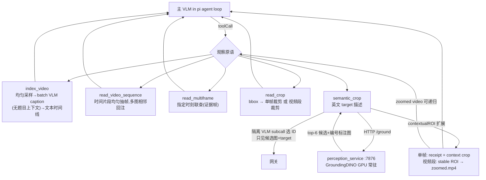

# pi 观察原语栈(extension + perception service)

## Purpose

为 pi harness 提供 task-agnostic 的视频时空观察原语(时间连续/离散证据/空间放大/语义定位)。
不含任务路由或领域推理。

S2.8 起 crop 工具从 object-level single-frame crop 重构为
**context-preserving image/video spatial-temporal zoom** 原语。
S2.6/S2.7 的 evidence closure 机制在全量评测中未提升总分(见对比表)，当前默认不加载。

## Architecture



## 观察原语一览

| 工具 | 输入 | 输出 | 用途 |
|------|------|------|------|
| `index_video` | video path | 文本时间线 | 发现值得看的时刻 |
| `read_video_sequence` | video + start_s + end_s | 多帧(时序标签) | 连续时间段观察 |
| `read_multiframe` | video + times_s[] | 多帧(时序标签) | 关键时刻联查 |
| `semantic_crop` | path + target + (time_s 或 start_s+end_s) | 单帧 crop 或 zoomed video | 语义定位局部场景 |
| `read_crop` | path + bbox + (time_s 或 start_s+end_s) | 单帧 crop 或 zoomed video | 显式 bbox 局部观察 |

## Crop 工具设计 (S2.8)

### Context-preserving crop

不再是 `entity bbox + 15% margin`，而是：

```
grounding bbox → contextualROI(60% expansion + 25% min extent) → crop
```

保留 interaction partner、background reference、relative geometry。

### Video segment zoom

```
semantic_crop(video, target, start_s=2.0, end_s=6.0)
  → 在 3 个时间点 ground target
  → temporal union of bboxes
  → contextualROI
  → stable ROI crop entire segment
  → zoomed_clip.mp4 (保存到 workspace)
  → agent 可递归 read_video_sequence/semantic_crop
```

**Stable ROI 原则**：不逐帧跟踪 entity（避免人为 camera motion 抵消 entity 运动），
整段视频使用同一个 ROI。

### 单帧 vs 视频段

| 模式 | 参数 | 输出 |
|------|------|------|
| 单帧 | `time_s` | crop 图片 (base64) |
| 视频段 | `start_s` + `end_s` | zoomed mp4 + preview frames |

## Evidence Closure (S2.6/S2.7, 当前不加载)

`evidence_closure.ts` 提供 silent ledger + submit_answer gate。
全量评测表明 closure gate 未提升总分，且增加 ~60% 耗时。保留代码供后续研究。

| 版本 | 90-subset | Full 403 (micro) | Full 403 (macro) | Avg time |
|------|-----------|-------------------|-------------------|----------|
| S2.4b (无 gate) | 56.7% | **56.3%** | **56.5%** | 91s |
| S2.6 (text checker) | 62.2% | 51.9~54.6% | 53.6~54.4% | 148s |
| S2.7 (visual checker) | 60.0% | 53.6% | 55.1% | 153s |

详见 `docs/code_maps/systems/evidence_closure.md`。

## Core Pseudocode

```text
semantic_crop(path, target, time_s?):          # 单帧模式
    frame = 原始分辨率帧 (视频则 ffmpeg -ss)
    cands = POST /ground {image, target, topk:6, annotate:true}
    id    = len(cands)==1 ? cands[0] : VLM("哪个编号匹配 target?", 标注图)
    roi   = contextualROI(cands[id].bbox, 60% expand, 25% min)
    return [receipt, crop(frame, roi)]

semantic_crop(path, target, start_s, end_s):  # 视频段模式
    for t in [20%, 50%, 80%] of segment:
        bbox_t = ground(target, frame_at(t))
    union = temporal_union(all bbox_t)
    roi   = contextualROI(union, 60% expand, 25% min)
    zoomed = ffmpeg crop video[segment] with roi
    save zoomed to workspace
    return [preview_frames, zoomed_video_path]

read_crop(path, bbox, time_s? / start_s+end_s?):
    单帧: crop image at time_s with bbox → base64
    视频段: crop video[segment] with bbox → zoomed mp4

perception_service:
    启动/首调加载 GroundingDINO → 常驻 GPU;/health /ground /annotate
```

## Code Pointers

| Symbol | Path | Role |
|--------|------|------|
| `vistrVideoTools` | `agent/pi_ext/vistr_video_tools.ts` | extension 入口,注册 5 工具 |
| `framesContent` | 同上 | 多帧+时间戳标签相邻回注(时序保持的核心) |
| `captionTimeline` | 同上 | index_video 的 batch caption 调用(硬约束:无题目) |
| `selectCandidate` | 同上 | semantic_crop 的隔离选择 subcall |
| `groundAtTime` | 同上 | 单时间点 grounding(视频段模式的子步骤) |
| `contextualROI` | 同上 | grounding bbox → context-preserving ROI |
| `cropVideoSegment` | 同上 | ffmpeg 视频段空间裁剪 → zoomed mp4 |
| `temporalUnion` | 同上 | 多时间点 bbox 求 temporal union |
| `evidenceClosure` | `agent/pi_ext/evidence_closure.ts` | S2.6/S2.7 closure gate(当前不加载) |
| `ground()` | `scripts/perception_service.py` | GroundingDINO 推理 + 编号标注图 |
| `EXTRA_TOOLS_NOTE` | `agent/eval_pi_agentic.py` | user prompt 工具清单 |
| `_select_answer` / `_parse_pi_json` | 同上 | committed answer 优先级、tool details 落盘 |

## Gotchas

- 网关流式 tool-call args 为累积式:pi-ai 需先打补丁 `scripts/patch_pi_cumulative_args.py`(npm 重装后重跑)
- GroundingDINO 文本仅英文(中文→[UNK])
- t=duration 抽帧为空 → 全部时间参数经 `clampT(dur-0.1)`
- perception 服务需先起(:7876),extension 只走 HTTP,禁止加载权重
- thinking subcall 的 `content=null` 是合法形态;reasoning 不能当 committed content
- zoomed video 写入 agent workspace(当前目录),agent 可对其递归调用工具
- temporal union 在 grounding 部分失败时仍可用(只需 ≥1 个时间点成功)
