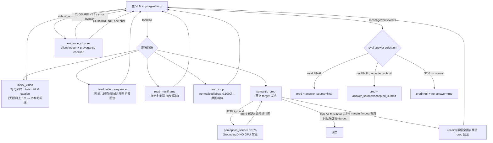

# pi 观察原语栈(extension + perception service)

## Purpose

为 pi harness 提供 task-agnostic 的视频时空观察原语(时间连续/离散证据/空间放大/语义定位)，
并在 s2.6 中以 silent ledger 记录 provenance、在提交答案时执行一次 evidence closure gate。
不含任务路由或领域推理。不处理:采样策略决策、checker 重新解题。

## Flow Diagram



## Core Pseudocode

```text
semantic_crop(path, target, time_s?):
    frame = 原始分辨率帧 (视频则 ffmpeg -ss)
    cands = POST /ground {image, target, topk:6, annotate:true}
    id    = len(cands)==1 ? cands[0] : VLM("哪个编号匹配 target?", 标注图)   # 不见题目
    box   = cands[id].bbox 外扩 15%(工具级常量,禁按任务调)
    return [receipt(/annotate 画选中框), crop(原图 ffmpeg)]

on observation tool_result:
    ignore failed index_video caption (caption_ok=false)
    map valid details to PERCEPTION/DERIVATION evidence
    record world-time + spatial scope + REFINES relations

submit_answer(answer, key_claim):
    if no direct perception: allow one re-observation round
    else checker(provenance summary)
    accept on YES, checker failure, or one-shot second submission

eval S2.6 answer:
    valid FINAL > last accepted submit_answer > no answer
    persist tool details + provider termination; never use reasoning fallback

perception_service:
    启动/首调加载 GroundingDINO → 常驻 GPU;/health /ground /annotate
    registry dict 可挂 SAM2/DA3/VGGT(未部署)
```

## Code Pointers

| Symbol | Path | Role |
|--------|------|------|
| `vistrVideoTools` | `agent/pi_ext/vistr_video_tools.ts` | extension 入口,注册 5 工具 |
| `framesContent` | 同上 | 多帧+时间戳标签相邻回注(时序保持的核心) |
| `captionTimeline` | 同上 | index_video 的 batch caption 调用(硬约束:无题目) |
| `selectCandidate` | 同上 | semantic_crop 的隔离选择 subcall |
| `evidenceClosure` | `agent/pi_ext/evidence_closure.ts` | silent ledger、时空 provenance、`submit_answer` one-shot closure gate |
| `ground()` | `scripts/perception_service.py` | GroundingDINO 推理 + 编号标注图 |
| `EXTRA_TOOLS_NOTE` | `agent/eval_pi_agentic.py` | user prompt 工具清单(**必须列全**,见 pi_harness.md §3 教训) |
| `_select_answer` / `_parse_pi_json` | 同上 | committed answer 优先级、tool details 与 provider termination 落盘 |

## Gotchas

- 网关流式 tool-call args 为累积式:pi-ai 需先打补丁 `scripts/patch_pi_cumulative_args.py`(npm 重装后重跑)
- GroundingDINO 文本仅英文(中文→[UNK])
- t=duration 抽帧为空 → 全部时间参数经 `clampT(dur-0.1)`
- perception 服务需先起(:7876),extension 只走 HTTP,禁止加载权重
- thinking subcall 的 `content=null` 是合法形态；reasoning 不能当 committed content
- 64k 服务必须与 pi `contextWindow=65536`、`reserveTokens=32768` 同步
- `read_crop` bbox 是 0-1000 静态区域，不是跨时间目标 tracker
