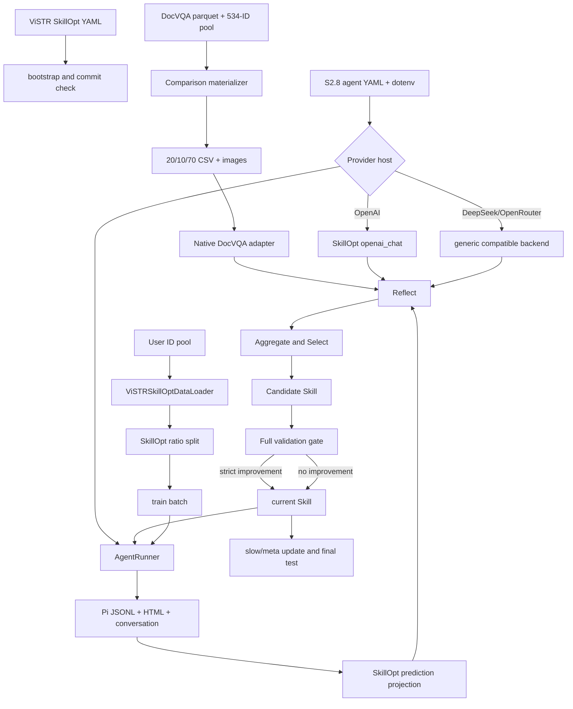

# Native SkillOpt training and cross-benchmark pilot

## Purpose

Runs the pinned upstream SkillOpt update loop around the fixed S2.8 Pi agent or
the native DocVQA agent. It also prepares and reports the fixed 100-item,
seed-43 system-level comparison.

## Flow diagram



## Core pseudocode

```text
read integration config and verify the clean SkillOpt commit
load the S2.8 config and reuse its policy provider as optimizer
route api.openai.com through SkillOpt openai_chat
route other OpenAI-compatible providers through the generic backend
filter data.json by the configured question IDs
let SkillOpt materialize a seeded 2:1:7 split
with AgentRunner:
    trainer requests a train or evaluation batch
    run Pi with the trainer's current candidate Skill
    retain native Pi artifacts and write a SkillOpt conversation projection
    return hard/soft results to the native ReflACT stages
trainer persists patches, gates, Skill versions, state, and final scores

comparison preparation samples both 100-item pools with seed 43
materialize only selected DocVQA validation images and answers
run each benchmark with batch 5 and 16 Fast Update Steps
report fast gate accepts; keep force-accepted slow updates separate
when expected_steps is supplied, reject partial or mismatched histories
```

## Code pointers

| Symbol | Path | Role |
|---|---|---|
| `main` / `_bootstrap` | `agent/skillopt/cli.py` | CLI, smoke overrides, source commit and dirty-tree checks |
| `run_training` | `agent/skillopt/integration.py` | Resolve configs, inherit optimizer provider, own runner lifetime |
| `_configure_skillopt_models` | `agent/skillopt/integration.py` | Select official OpenAI or generic compatible SkillOpt request path |
| `ViSTRSkillOptDataLoader` | `agent/skillopt/integration.py` | Validate ID pool and delegate deterministic splitting to SkillOpt |
| `ViSTRSkillOptAdapter` | `agent/skillopt/integration.py` | Convert batches, invoke Pi, and project trajectory/results |
| `export_and_materialize` | `agent/runtime/artifacts.py` | Persist native artifacts and SkillOpt `cmd/obs` tool fields |
| `prepare` | `agent/skillopt/prepare_comparison.py` | Deterministic sampling and DocVQA CSV/image materialization |
| `summarize_run` / `compare` | `agent/skillopt/compare_runs.py` | Count Effective Updates, enforce optional completed-step budget, and produce the paired report |
| `main` | `scripts/handover_preflight.py` | Validate clean-machine dependencies/data and optionally probe GPT image+tool calls |

## Artifact boundary

Pi JSONL, HTML, decoded images, and canonical conversations stay below the
agent YAML's `artifacts.trajectory_root`. SkillOpt's `out_root` contains its
config/state/history, generated split, step patches and Skills, plus
`predictions/<id>/` projections that point back to the native trajectory.
