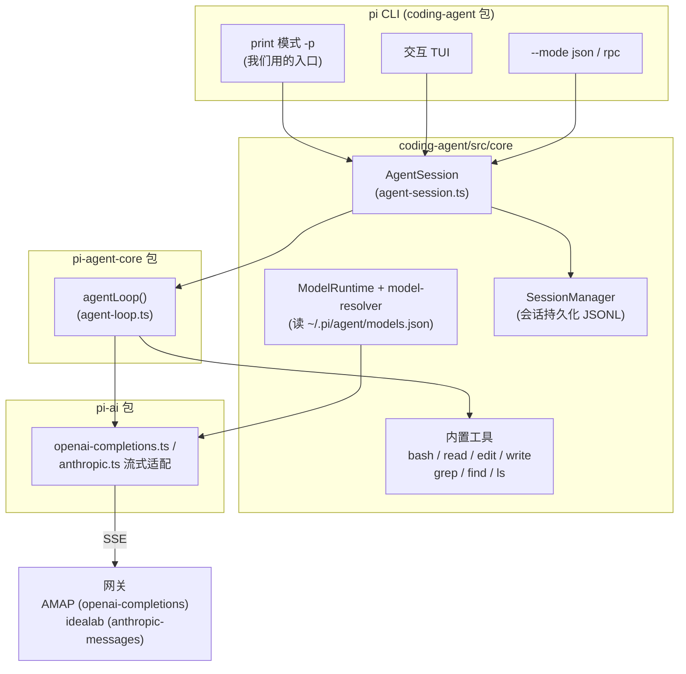
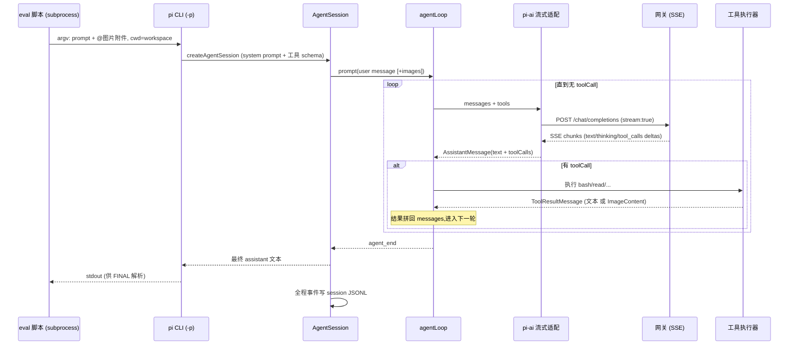
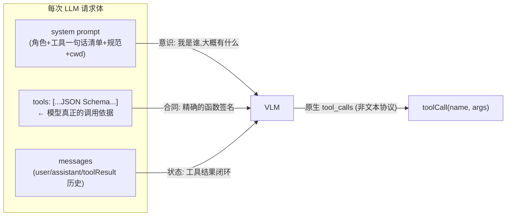
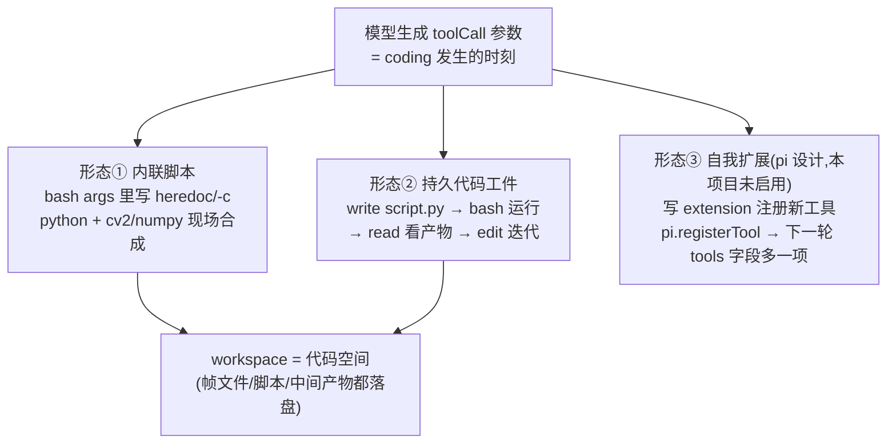
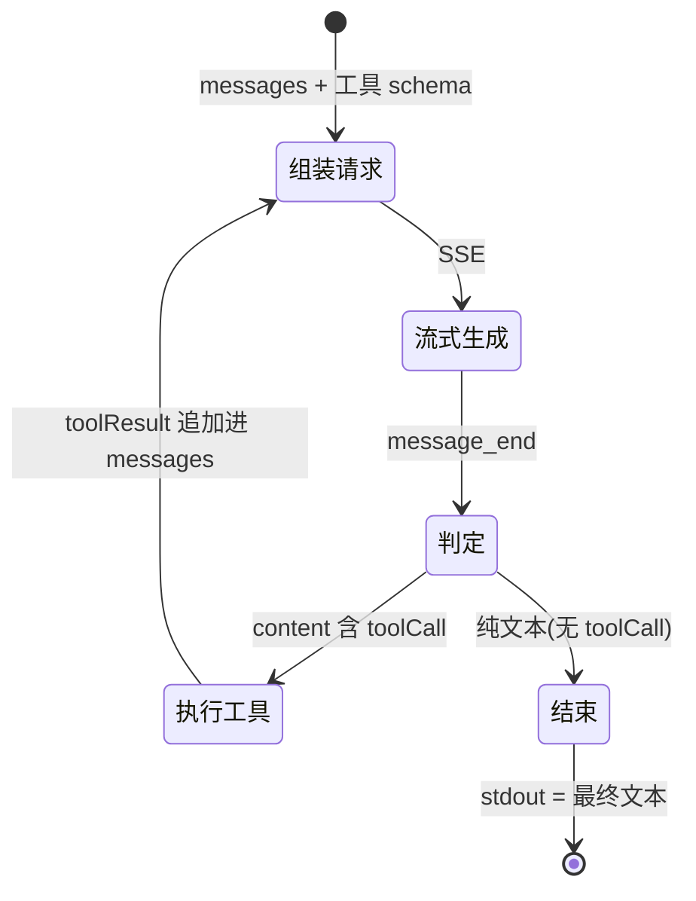
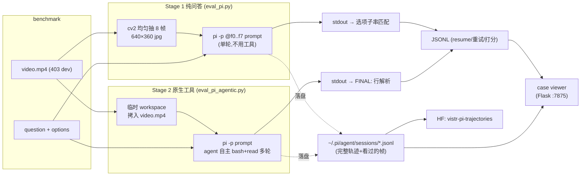
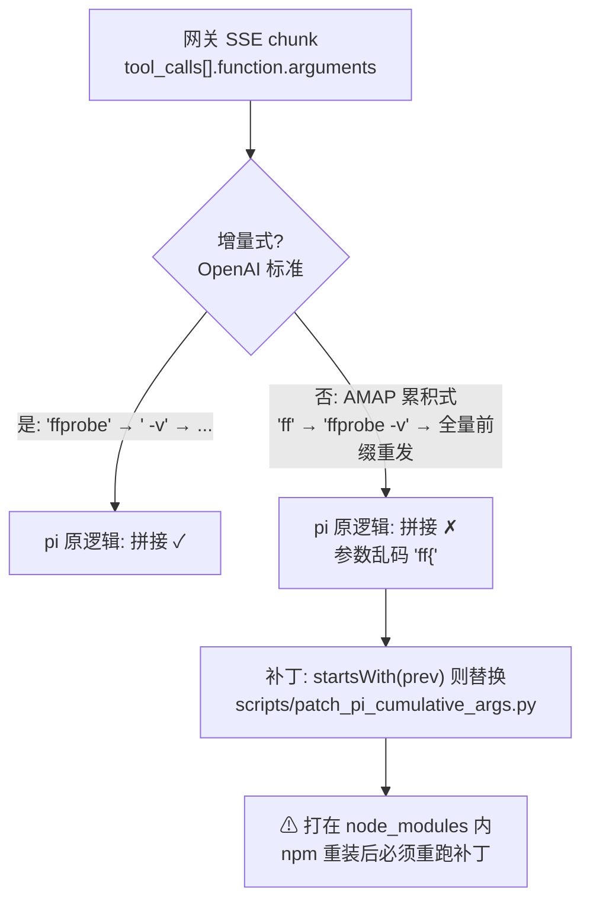

# pi Harness — 数据流与工作流刻画

pi(https://github.com/earendil-works/pi, v0.84.0)是 TypeScript coding agent,
本项目将其作为 ViSTR-Bench 评测 harness。本文刻画其内部数据流,以及我们两种评测模式
(Stage 1 纯问答 / Stage 2 原生工具)的完整链路。

安装位置: `third_party/pi-runtime/node_modules/.bin/pi`(npm 局部安装,Node ≥22.19)。

## 1. 总体架构

pi 是 monorepo,我们用到的核心包及依赖关系:



要点:
- **模型接入**只需 `~/.pi/agent/models.json`(provider: baseUrl + api + apiKey + models),
  不改任何代码;`--provider X --model Y` 选择。
- **会话落盘**: 每次运行(含 `-p`)都写 `~/.pi/agent/sessions/<cwd-slug>/<ts>_<uuid>.jsonl`,
  这是我们轨迹分析/case viewer/HF 打包的数据源。

## 2. 单次 `pi -p` 调用的数据流(时序)



## 3. 每次调用 VLM 时的 Prompt 构建思想

关键认知:**"模型知道有哪些工具"不是靠 system prompt 写出来的,而是靠 API 的
`tools` 字段(JSON Schema)**。system prompt 只做"意识与规范",schema 才是"可调用的合同"。
两层分工(源码 `coding-agent/src/core/system-prompt.ts:buildSystemPrompt`):



### 3.1 system prompt 的解剖(默认模板,逐段拼接)

```text
You are an expert coding assistant operating inside pi, a coding agent
harness. You help users by reading files, executing commands, editing
code, and writing new files.
                                            ← ① 角色定位(写死)
Available tools:
- read: Read file contents
- bash: Execute bash commands (ls, grep, find, etc.)
- edit: Edit files by replacing exact text
- write: Create or overwrite files
                                            ← ② 工具"一句话清单"
                                              每个工具的 promptSnippet 字段,
                                              仅告知存在性,不含参数!
Guidelines:
- Use read to examine files instead of cat or sed.
- Be concise in your responses
- Show file paths clearly when working with files
                                            ← ③ 各工具的 promptGuidelines 汇入
                                              (用途引导/防误用)
<project_context>
<project_instructions path=".../AGENTS.md">...</project_instructions>
</project_context>                          ← ④ cwd 下的 AGENTS.md 自动注入
                                              (我们的临时 workspace 无此文件)
Current working directory: /tmp/pi_ws_xxx   ← ⑤ 世界锚点
```

### 3.2 工具能力的真正来源:`tools` 字段

每个工具在源码里是 `{name, description, parameters(TypeBox schema), execute}` 四元组,
pi-ai 把前三者序列化进请求(OpenAI 形态 `tools[].function`,Anthropic 形态 `tools[].input_schema`):

```json
{"type": "function", "function": {
  "name": "read",
  "description": "Read the contents of a file. Supports text files and
    images (jpg, png, gif, webp, bmp). Images are sent as attachments.
    ... Use offset/limit for large files.",
  "parameters": {"type": "object", "properties": {
    "path":   {"type": "string", "description": "Path to the file to read"},
    "offset": {"type": "number", "description": "Line number to start from"},
    "limit":  {"type": "number", "description": "Maximum number of lines"}},
    "required": ["path"]}}}
```

设计思想总结:

| 层 | 内容 | 目的 |
|----|------|------|
| system prompt ② | 一句话 snippet | 让模型"记得"工具存在,省 token |
| system prompt ③ | 工具级 guideline | 行为规范(如"用 read 别用 cat"——保证图片走多模态通道) |
| `tools` schema | 完整 description + 参数 JSON Schema | 模型生成合法 `tool_calls` 的唯一依据 |
| toolResult 消息 | 文本 或 **ImageContent**(read 读图) | 结果闭环;图片以多模态块回注,这是 S2 能"看帧"的机制 |

对我们最重要的一条:**read 工具的 description 明确写了支持图片且"Images are sent
as attachments"**——VLM 因此学会"bash 抽帧 → read 看图"的组合拳;而我们的 user prompt
(eval_pi_agentic.py 的 PROMPT)只需给业务引导(视频路径、建议 ffprobe/抽帧、FINAL 格式),
无需重复工具说明。

> **教训(2026-08-07,S2.4 实证)**:pi 会把每个注册工具(含 extension 工具)的
> `promptSnippet` 动态重建进 system prompt(`agent-session.ts:_rebuildSystemPrompt`),
> 即新工具天然会被"广告"。但如果 **user prompt 里显式枚举了一份不完整的工具清单**,
> 模型注意力会被钉死在清单内——semantic_crop 虽在 system prompt + schema 中,
> 85 个 session 仅被调 5 次(read_crop 178 次)。
> 规则:user prompt 要么不列工具(信任 pi 的机制),要列就必须列全。

### 3.3 我们两种模式下的完整请求组成

| | Stage 1 | Stage 2 |
|---|---|---|
| system | 默认模板(工具清单仍在,但模型无需用) | 默认模板 |
| tools 字段 | 默认 4+ 工具 schema(冗余 ~1.5k token) | 同左,且被高频使用 |
| user 消息 | `<file>` 标记 + 8 张 image 块 + 题目 prompt | 纯文本题目 prompt(图靠 read 自取) |
| 后续消息 | 无(单轮) | assistant(toolCall) ⇄ toolResult(文本/图片) ×~15 轮 |

### 3.4 模型的 coding 发生在哪个环节?

工具清单是固定的,但**能力空间不是**——`bash` 是图灵完备的逃逸口,`write` 让代码
成为持久工件。模型的 coding 不是"调用预设工具",而是**在生成 toolCall 参数的那一刻
现场写程序**。三种形态(按耦合度递增):



Stage 2 实测(抽样 200 个 session 的 toolCall 统计):

| 调用 | 次数 | 说明 |
|------|------|------|
| read | 1604 | 主要是看帧图 |
| bash → ffmpeg/ffprobe | 775 | 命令级"胶水编程" |
| bash → python 内联 | 188 | **现场写 cv2/numpy 程序**:裁剪放大、阈值分割、位置追踪 |
| write(.py 文件) | 97 | 如 `extract_frames.py`、`analyze_vehicle_cones.py`(锥桶位置分析) |
| edit | 1 | 改自己写的脚本 |

真实例子(模型在 bash 参数里合成的代码,做泳者头部 x 坐标追踪):

```python
/opt/conda/bin/python -c "
import cv2, numpy as np
def get_head_x(img, y_start, y_end, x_start=1600):
    roi = img[y_start:y_end, x_start:]
    gray = cv2.cvtColor(roi, cv2.COLOR_BGR2GRAY)
    _, thresh = cv2.threshold(gray, 180, 255, cv2.THRESH_BINARY)  # 找亮色泳帽
    ..."
```

结论:pi 的工具层设计是"**最小执行通道 + 开放动作空间**"——与 V4(动作映射到预建代码)
和 SpatialClaw(CodeGen→Jupyter)相比,pi 不预设分析代码,分析程序完全由模型按题目
现场合成,写坏了还能 read 报错→edit 修复,形成完整的 coding 闭环。这正是
"代码空间作为 agent 活动的大世界"的实现方式。

### 3.4.1 重要缺陷:单图阅读破坏时序连续性(2026-08-07 实测)

轨迹量化(250 session):**87% 的看图轮次一次只 read 1 张**(1355/1555),
**0 次自发拼图**(tile/montage/hconcat)。每帧作为独立 toolResult 回注,帧间还隔着
模型自己的分析文本 → 帧间比较退化为"记忆 vs 眼前",而 S1 的 8 帧同消息相邻可直接
做帧间 attention。这是 Relative_Velocity 68%(S1)→40%(S2)崩塌的机制。

对策候选:① prompt 强制先 ffmpeg tile 网格总览;② 开局直贴 8 帧 + 保留工具(S1×S2 混合);
③ pi extension 自定义 read_frames 多图工具。

## 3.5 Agent 内循环(工具决策状态机)



Stage 2 实测行为(qwen3-vl-plus, 403 题):平均 **14.7 轮 / 13.9 次工具调用 / read 看图 6.2 张**。
典型链路:`ffprobe 元数据 → ffmpeg 选择性抽帧 → read 逐帧看 → bash 裁剪放大 → FINAL`。

## 4. 我们的两种评测模式



| | Stage 1 | Stage 2 |
|---|---|---|
| 输入 | 8 帧直贴对话 | 视频文件 + 工具 |
| 轮数 | 1 | ~15 |
| 耗时/题 | ~21s | ~95s (qwen) |
| qwen3-vl-plus | **54.6%** | 53.8% |
| 互补性 | 运动感知类强 (Relative_Velocity 68%) | 关键瞬间类强 (Basketball +11pp) |

union oracle 71.7% → 混合路由是下一步方向。

## 5. 关键兼容点(踩坑记录)



其余兼容点:
| 问题 | 处理 |
|------|------|
| AMAP 网关不支持 `developer` role / `reasoning_effort` | models.json `compat.supportsDeveloperRole/supportsReasoningEffort = false` |
| idealab (anthropic) 拒绝 `thinking.adaptive.budget_tokens` | 模型注册 `reasoning: false`(服务端自带 thinking) |
| idealab 偶发 "use case not submitted" 错误(~4%/请求) | eval 脚本 pi 子进程重试 ×3 + resume 丢弃 error 行重跑 |
| session 积累(含帧 base64,1.9GB/全量) | 定期清理 `~/.pi/agent/sessions/` |
| pi 版本 | v0.84.0;`pi update` 会破坏补丁,升级需重验 |

## 相关资产

- 脚本: `agent/eval_pi.py`、`agent/eval_pi_agentic.py`、`scripts/patch_pi_cumulative_args.py`、
  `scripts/build_case_viewer.py`、`scripts/pi_case_viewer.py`、`scripts/upload_hf_pi_trajs.py`
- 计划书: `plans/completed/0806-[pi作为harness]stage{1,2}-*.md`
- run logs: `runs/2026-08-06_pi_stage1_dev.md`、`runs/2026-08-06_pi_stage2_agentic_dev.md`
- 轨迹数据集: https://huggingface.co/datasets/MihailSlutsky/vistr-pi-trajectories
