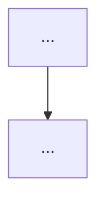

# pi 作为 harness — Stage 2.5 证据账本(evidence-only SEL)

## User Goal

> Written by the user. Can be informal, any language, incomplete.
> Agent must NOT delete, overwrite, or alter this section.

对，这块前面应该先把“为什么要做”讲清楚，不然 CC 只会把它理解成“又加一个状态管理 extension”，不知道我们是在解决什么真实 failure。你可以直接把下面这一段接到计划书里，当 **第五阶段 / S2.5** 的 User Goal 背景。

### 第五阶段

> 前面几个阶段主要是在补 Pi 的 observation affordance：
>
> * `read_video_sequence` / `read_multiframe` 解决一次只看一张图的问题；
> * `index_video` 提供视频的粗粒度时间索引；
> * `semantic_crop` 用 GroundingDINO + VLM candidate selection，把 spatial grounding 从主 Agent 的 bbox 算术中剥离出来。
>
> 到 S2.4b，这套 observation 工具已经明显改变了 Agent 的行为，`semantic_crop` 也已经证明是有效的视觉观察原语。此时新的瓶颈不再只是“Agent 看不到什么”，而开始变成：
>
> > **Agent 已经看过很多不同形式的 evidence，但当前 Pi harness 只是按照 tool call 的先后顺序，把它们平铺在一条 reasoning transcript 里。模型并没有一个明确的结构去理解：这些 evidence 分别来自视频的什么时候、覆盖画面的什么区域、彼此是补充关系还是替代关系。**
>
> 我们分析 case 时发现了一个很典型的 failure。
>
> 在一个 Fall Direction 样例里，Agent 先通过：
>
> ```text
> read_video_sequence(2.50s → 3.12s)
> ```
>
> 连续看了 6 帧。这个 observation 覆盖的是：
>
> ```text
> 时间：一个连续 interval [2.50, 3.12]
> 空间：full frame
> ```
>
> 模型已经基于这段连续运动形成了一个方向判断。
>
> 随后 Agent 为了“进一步确认”，又调用：
>
> ```text
> semantic_crop(time=3.12s, target="the person falling...")
> ```
>
> 得到了一张非常清楚的高清人物局部图。这个 observation 实际只覆盖：
>
> ```text
> 时间：单点 {3.12s}
> 空间：person local bbox
> ```
>
> 但在普通 Pi trajectory 里，这两个 evidence 只是：
>
> ```text
> tool result #2
> ↓
> reasoning
> ↓
> tool result #3
> ```
>
> 后面的高清 crop 因为更晚出现、视觉上更清晰，模型很容易把它当成“更强的新证据”，重新围绕单帧身体姿态进行解释，甚至把之前基于连续运动得到的正确判断反思坏。
>
> 这里的问题并不是 `semantic_crop` ground 错了。相反，它成功完成了自己的职责：**精确地提供某一时刻的局部空间 observation。**
>
> 真正的问题是：
>
> > **一个 point-time / local-space evidence，被 Agent 当成了可以覆盖 interval-time / global-space evidence 的 replacement。**
>
> 也就是说，普通 coding-agent harness 天然维护的是 **reasoning time**：
>
> ```text
> step 1 → step 2 → step 3 → step 4
> ```
>
> 但视频推理还存在另一套 **world/video time + spatial scope**：
>
> ```text
> 0s ---------------------- 3.22s
>
> E1: whole-video sparse timeline
> E2: [2.50, 3.12] × full frame
> E3: {3.12} × person bbox
> ```
>
> 当前 Pi 会把第二种结构压扁成第一种结构。这样就容易产生：
>
> ```text
> later observation
> ≈ newer evidence
> ≈ stronger evidence
> ≈ can overwrite previous evidence
> ```
>
> 但对视频时空推理来说，这个假设显然不成立。
>
> 因此第五阶段希望参考 **Structured Evidence Ledger** 的基本思想，为 Pi 增加一个轻量的 structured evidence state。这里不是要完整复刻 LedgerMind 的 task planner / dispatcher / 强制 reasoning format，而是先借它最核心的一点：
>
> > **tool observation 不应该只是聊天历史中的一条消息，而应该被持久地登记为具有 provenance、scope 和 relation 的 evidence。**
>
> 对我们来说，这个 evidence state 还需要显式区分两个时间：
>
> ```text
> agent_step
>     = Agent 在第几步获得这个 evidence
>
> world_time_support
>     = 这个 evidence 实际描述视频里的哪个时间范围
> ```
>
> 并同时记录：
>
> ```text
> spatial_support
>     = full frame / bbox / local region
> ```
>
> 这样，上面的 case 在 harness 内部应该被理解成：
>
> ```text
> E2
> source = read_video_sequence
> agent_step = 3
> world_time = [2.50, 3.12]
> space = global
>
> E3
> source = semantic_crop
> agent_step = 4
> world_time = {3.12}
> space = local(person bbox)
>
> relation:
> E3 REFINES E2
> ```
>
> 而不是因为 `E3` 出现在 `E2` 后面，就默认：
>
> ```text
> E3 SUPERSEDES E2
> ```
>
> 第一版只希望解决 **“Agent 对自己已经看过什么、这些 evidence 分别适用于哪个时空范围”有持续意识** 这个问题。
>
> 暂时不要进一步要求模型维护完整 claim graph，也不要强制它使用 `[E1] / [E2]` citation、`[E]→[I]→[J]` reasoning template 或 question-specific evidence router。那些会明显改变 Pi 原本自由的 reasoning policy，无法判断提升究竟来自 evidence state，还是来自新的手工 reasoning scaffold。
>
> 本阶段首先做一个 **evidence-only Structured Evidence Ledger**。

新增一个独立的 evidence_ledger Pi extension layer，不增加任何新的 LLM-callable tool。用 Pi tool_result hook 将现有 observation tool result 通过 deterministic tool-specific mapper 规范化为 evidence entry；用 context hook 在每次 LLM inference 前注入唯一一份 compact active ledger；用 appendEntry 将 ledger state/transition 持久化到 Pi session JSONL，方便 resume 和 trajectory evaluation。不要修改现有 observation policy，也不要加入 ViSTR task router。

Ledger schema 参考 LedgerMind SEL，但针对视频增加独立的 agent_step 与 world_time_support，以及 spatial_support。固定视频证据第一版不使用 wall-clock TTL。read_video_sequence 映射为 interval/global，read_multiframe 为 discrete/global，semantic_crop 为 point/bbox，index_video 因内部使用 caption VLM 应标为 DERIVATION 而非 raw PERCEPTION。工具事实必须来自 event.input/details 的确定性映射，禁止额外调用 LLM 给视觉结果生成“person moving left”之类的 evidence summary。

自动计算 evidence 之间的 spatiotemporal support relation；若新 observation 的 temporal/spatial support 是旧 observation 的真子集，则标记 REFINES，不得仅因 reasoning step 更新而自动 supersede。例如 sequence [2.5,3.12] × full-frame 后的 semantic crop {3.12} × bbox 是 refinement，不是 replacement。

当前 semantic_crop.details 补全 path/time_s/target/frame_size/grounding_bbox/crop_bbox/phrase/grounding_score/candidate_count/selection_mode。GroundingDINO score 只能记录为 producer/grounding score，不要直接当作整体 evidence confidence。

native image read 也进入 ledger；无法恢复 video timestamp 时明确记 world_time=unknown。第一版不要解析任意 bash/ffmpeg 命令推断时间，避免脆弱 heuristics。

S2.5 首先只实现 evidence provenance + 4D scope + lifecycle/refinement。不要立即复制 LedgerMind 的 task planner、complexity dispatcher、OC semantic category、ECC/NCC、Dual-Read 或 [E]→[I]→[J] 强制 reasoning format。等 evidence-only ablation 跑完，再决定是否加入 claim↔evidence dependency 和 typed repair。

> 新增一个独立的 `evidence_ledger` Pi extension layer，不增加新的 LLM-callable tool。
>
> 利用 Pi 已有的 extension hooks：
>
> ```text
> tool_result
>     → 捕获 observation tool 的 input / details
>     → deterministic mapper
>     → 写入 ledger
>
> context
>     → 每次 LLM inference 前
>     → 注入 compact active evidence state
>
> appendEntry
>     → 将 ledger state / transitions 持久化进 Pi session
> ```
>
> 不修改现有 observation policy，也不加入 ViSTR task router。
>
> Ledger schema 参考 Structured Evidence Ledger，但针对当前视频场景至少增加：
>
> ```text
> evidence_id
> source
> agent_step
> world_time_support
> spatial_support
> epistemic_type
> lifecycle
> relations
> producer_metadata
> ```
>
> 其中 evidence 的时空信息尽量从 tool 的 `input/details` **确定性产生**，不要额外调用 VLM 总结成 `"person is moving left"` 之类的自然语言 fact。
>
> 当前工具可确定性映射为：
>
> ```text
> index_video
> → world_time = discrete sampled timeline
> → space = global
> → epistemic_type = DERIVATION
>
> read_video_sequence
> → world_time = interval [start,end] + sampled timestamps
> → space = global
> → epistemic_type = PERCEPTION
>
> read_multiframe
> → world_time = discrete {t1,t2,...}
> → space = global
> → epistemic_type = PERCEPTION
>
> semantic_crop
> → world_time = point {t}
> → space = bbox
> → target / grounding metadata
> → epistemic_type = PERCEPTION
>
> read_crop
> → world_time = point / unknown
> → space = bbox
>
> native read(image)
> → 也登记为 PERCEPTION
> → 如果无法可靠恢复其 video timestamp，就明确记 world_time=unknown
> ```
>
> 第一版不要解析任意 bash / ffmpeg 命令去猜 timestamp，避免脆弱 heuristics。
>
> `semantic_crop.details` 同时补齐：
>
> ```text
> path
> time_s
> target
> frame_size
> grounding_bbox
> crop_bbox
> grounding_phrase
> grounding_score
> candidate_count
> selection_mode
> ```
>
> 注意 GroundingDINO score 只能表示 grounding backend 的 producer score，不要直接等价成整个 evidence 的 epistemic confidence。
>
> Harness 还应自动推导最简单的 spatiotemporal relation。尤其是：
>
> ```text
> 新 evidence 的 temporal support ⊆ 旧 evidence
> 且 spatial support ⊆ 旧 evidence
> ```
>
> 时，将其表示为：
>
> ```text
> REFINES(old_evidence)
> ```
>
> 而不是因为获得时间更晚就 `SUPERSEDES`。
>
> 例如：
>
> ```text
> read_video_sequence:
> [2.50, 3.12] × full-frame
>
> semantic_crop:
> {3.12} × person-bbox
> ```
>
> 后者是前者的局部 refinement。
>
> 每次 LLM inference 前只注入一个很短的 active evidence dashboard，例如：
>
> ```text
> <EVIDENCE_STATE>
> E1 | index_video
>    world-time = sparse [0.00 ... 3.12]
>    space = global
>
> E2 | read_video_sequence
>    world-time = [2.50, 3.12]
>    space = global
>
> E3 | semantic_crop
>    world-time = {3.12}
>    space = local(person)
>    relation = REFINES(E2)
>
> Evidence obtained later in agent time does not automatically
> supersede evidence with broader world-time/spatial support.
> </EVIDENCE_STATE>
> ```
>
> 这个 state 是 **index / provenance dashboard，不是第二份完整 context**；不要重复塞历史图片，也不要重新总结全部 reasoning。
>
> 当前视频是离线固定 observation，因此第一版不要机械复刻 Structured Evidence Ledger 的 wall-clock TTL。视频中 3.12s 的 evidence 不会因为 Agent 又思考了几十秒就失效。
>
> 第一版重点验证：
>
> > **仅加入 evidence provenance + world-time/spatial scope + refinement relation，在不改变 Agent task reasoning policy 的前提下，是否能降低 later/local observation 对 earlier/temporal evidence 的错误覆盖。**
>
> 特别统计新增 observation 前后的：
>
> ```text
> Correct → Correct
> Wrong   → Correct
> Correct → Wrong
> Wrong   → Wrong
> ```
>
> 并观察 `Correct → Wrong` 是否下降。
>
> 如果 evidence-only 版本有效，下一阶段再考虑 Structured Evidence Ledger 更完整的部分，例如 claim ↔ evidence dependency、CONFLICTED / SUPERSEDED lifecycle 和 typed repair；本阶段先不要一起加。

这样 CC 就知道：**我们不是突然想加 memory，而是 S2.4b 工具已经把“看什么”基本解决之后，真实 case 暴露出了“看过的异构时空 evidence 被一维 transcript 错误组织”的问题。**

这个背景对它很重要，不然它很容易给你造一个 generic memory manager，方向就偏了。

## For Agent: Execution Protocol

1. Read and follow `docs/agent/always.md`.

2. Based on **User Goal**, fill in:
   - `Agent Refined Plan`
   - `Required Agent Resources`
   - `Acceptance Criteria`

3. To find available Rules, Skills, or Playbooks, check:
   - `docs/registry/agent_system.md`
   - Do not load everything — only what's relevant.

4. When refining:
   - User Goal is the highest source of truth.
   - Do not omit any explicit user requirement.
   - Do not expand scope beyond what was asked.
   - Non-blocking side issues: note them, don't pursue them.
   - If there's ambiguity, danger, or high cost: ask the user first.

5. After implementation and verification, fill in the **Execution Report**.

6. Before user approval:
   - Set status to `awaiting_approval`, not `completed`.
   - Do not archive the plan.
   - Do not describe experimental results as final conclusions.

7. After user approval, complete this **archival checklist** (do not skip):
   - [ ] Update status to `completed`, move to `plans/completed/`.
   - [ ] Update `docs/working_logs/active.md`.
   - [ ] **Register new assets**: new scripts → `registry/scripts.md`; new data/outputs → `registry/outputs.md` or `registry/datasets.md`.
   - [ ] **Register new agent resources**: new rules/skills/playbooks → `registry/agent_system.md`.
   - [ ] If document structure changed, update `docs/README.md`.
   - [ ] If an experiment was run, write a run log to `working_logs/runs/`.
   - [ ] **Evaluate Code Map**: per `rule:human-code-review`, decide if this implementation needs a new or updated `docs/code_maps/` document.

## Agent Refined Plan

### Understanding

S2.4b 后瓶颈从"看不到"转为"看过的异构时空证据被一维 transcript 错误组织"
(later/local 证据覆盖 earlier/interval 证据,如 Fall/Swimming 案例)。
S2.5 做 **evidence-only Structured Evidence Ledger**:独立 `evidence_ledger` extension,
零新 LLM 工具;`tool_result` hook 确定性登记(agent_step 与 world_time_support 分离
+ spatial_support);`context` hook 每次推理前注入唯一一份 compact dashboard
(CustomMessage,role:custom);`appendEntry` 持久化 state/transition。
可行性已核对:pi 有 `tool_result`(event.toolName/input/details)、`context`
(可改 messages)、`appendEntry`;`-e` 可多次加载。

### Scope

#### In Scope

- `semantic_crop.details` 补全(path/time_s/target/frame_size/grounding_bbox/crop_bbox/
  phrase/grounding_score/candidate_count/selection_mode);grounding_score 仅作 producer score
- `agent/pi_ext/evidence_ledger.ts`:
  - mapper(确定性,禁 LLM 摘要):sequence→interval×global PERCEPTION;
    multiframe→discrete×global PERCEPTION;semantic_crop→point×bbox PERCEPTION;
    read_crop→point/unknown×bbox;read(image)→PERCEPTION,world_time=unknown;
    index_video→discrete timeline×global **DERIVATION**
  - REFINES:新证据时空 support 为旧的真子集 → REFINES(old),绝不因 step 靠后 SUPERSEDE
  - dashboard:紧凑文本(id/source/world-time/space/relation + 一句元规则),
    不重复图片/不总结 reasoning;无 wall-clock TTL
- 冒烟:验证登记、REFINES 判定、dashboard 注入、appendEntry 落盘
- `--per-task 6` 90 题(S2.5)对比 S2.4b

#### Out of Scope

- claim graph / 强制 citation / [E]→[I]→[J] 模板 / task planner / dispatcher /
  ECC/NCC / Dual-Read / typed repair(等 evidence-only ablation 结果)
- 解析 bash/ffmpeg 命令推断时间(脆弱)
- 全量评测

### Steps

1. 补 semantic_crop details → 2. evidence_ledger.ts → 3. 冒烟(轨迹检查)
→ 4. S2.5 90 题 → 5. 对比 + 转变矩阵(后验解析,尽力而为,报告中注明噪声)
→ 6. Execution Report → awaiting_approval

## Required Agent Resources

### Rules
- `docs/agent/always.md`(抽样约定)
### Skills
- 无
### Playbooks
- `docs/knowledge/pi_harness.md`、`docs/code_maps/systems/pi_observation_stack.md`

## Acceptance Criteria

- [ ] ledger 登记全部观察工具结果,字段确定性来源(无 LLM 摘要)
- [ ] REFINES 判定正确(sequence→crop 案例冒烟复现)
- [ ] 每次推理仅注入一份 compact dashboard;appendEntry 可在 session JSONL 中查到
- [ ] 90 题 S2.5 vs S2.4b 对比 + (尽力)转变统计;评估指标噪声在报告中如实标注
- [ ] 已知混杂因素(dashboard 元规则句)在报告中声明

---

## Execution Report

### Summary

- ...

### Changed Files

| File | Change |
|------|--------|

### Commands

```bash
# Key commands executed
```

### Verification Results

```text
# Output and conclusions
```

### Outputs

- ...

### Remaining Issues

- ...

### Human Review Guide

#### What changed conceptually

- ...

#### Execution flow



#### Core pseudocode

```text
...
```

#### Key code pointers

* `path/file.py:function_name`

#### Code maps created/updated

* (link to new or updated code map, or N/A)

### Suggested Next Step

- ...

