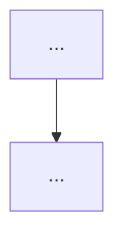

# <Task Title>

## User Goal

> Written by the user. Can be informal, any language, incomplete.
> Agent must NOT delete, overwrite, or alter this section.

前面我们已经把 Pi 作为 4D / Video Agent harness 的一个毛坯框架基本搭起来了。

目前整体结构其实已经比较清楚：

- Pi 本身负责通用 reasoning、coding、bash、文件操作；
- `read_video_sequence` / `read_multiframe` 解决 coding agent 天生喜欢“一次只看一张图”的问题，让它能一次联合观察一个连续过程或者多个关键时刻；
- `index_video` 提供一个低频的视频时间线，帮助 Agent 自己发现值得进一步看的位置；
- `semantic_crop` 通过 GroundingDINO 这种外部 perception backend，让主 VLM 可以直接说“我想看什么”，而不用自己手算 bbox；
- Evidence Ledger 负责记录 Agent 到底在什么时间、什么空间范围、通过什么类型的 observation 看过哪些 evidence；
- S2.6 又在这个基础上加了一个 `submit_answer` closure gate，希望在 Agent 最终提交答案之前，检查它的关键结论是否真的已经有直接视觉 evidence 支撑。

目前这套框架已经能够达到不错的效果，但我们检查 S2.6 的 closure 行为后发现了一个很根本的问题：

> **现在的 checker 被要求审计“关键声明是否被视觉 evidence 直接确认”，但 checker 实际上根本没有看到视觉 evidence。**

当前 silent ledger 记录的主要是这种信息：

```text
E1 | index_video | DERIVATION | time={...} | space=global
E2 | read_video_sequence | PERCEPTION | time=[2.2, 2.8] | space=global
E3 | semantic_crop | PERCEPTION | time={2.5} | space=bbox(...)
````

也就是说，ledger 知道：

> “Agent 在什么时候、什么位置、通过什么工具看过东西。”

但它不知道：

> “Agent 当时实际看到了什么。”

例如篮球题里：

```text
key_claim:
the ball passes through the hoop around 2.5s
```

checker 只能看到：

```text
E3 | semantic_crop | PERCEPTION | time=2.5s | hoop region
```

却看不到 E3 对应的那张 crop，也不知道 crop 里面到底是：

* 球已经穿过篮筐；
* 球还在篮筐上方；
* 球偏出了篮筐；
* 还是 GroundingDINO 根本 crop 错了。

在这种输入条件下，checker 实际上没有能力判断：

> “这个 key claim 是否已经被 direct visual evidence confirmed。”

所以目前大量 checker 回复都会变成：

```text
only timestamps and a claim are given
the evidence does not state the observed content
no explicit visual confirmation is provided
```

最终 run 里接近 98% 都被判成 `CLOSURE: NO`。

这不是简单的 checker prompt 太保守，也不主要是 VLM 后端不行，而是：

> **checker 的输入 contract 和 checker 被要求完成的任务根本不匹配。**

现在这个 checker 真正有能力做的，其实只是：

> provenance audit

也就是判断：

```text
Agent 有没有在相关时间/空间做过一次 PERCEPTION？
还是只看了 index_video caption 这种 DERIVATION？
```

但它没有能力做真正的：

> semantic evidence closure

也就是判断：

```text
这些 PERCEPTION 的视觉内容到底有没有确认 key_claim？
```

因此下一步要解决的不是继续调 `CLOSURE: YES/NO` prompt，也不是简单把 tool result 的前几百个字符塞进 ledger。

因为我们的 observation tool 真正有价值的内容本来就在图片里。

例如 `semantic_crop` 的文字部分可能只有：

```text
chose candidate #3
score 0.91
high-resolution crop...
```

真正决定：

> “球有没有进框”

的是后面的 crop image。

`read_video_sequence` 也一样，文字只能说明：

```text
这里读取了 2.3s–2.8s 的若干帧
```

真正的运动过程在那几张 image 里。

所以即使给 checker 存更多 tool-result text，它依然只是知道：

> “Agent 看过几张图。”

而不是：

> “这些图具体证明了什么。”

这一阶段希望把 Evidence Closure 的输入接口真正补完整：

> **让 closure checker 在审计关键声明时，能够访问对应的实际视觉 evidence，而不仅仅看到 evidence metadata。**

这里不希望把 checker 做成另一个完整 Video QA solver，也不希望让它重新从头看整个视频。

更合理的方向应该是：

```text
Main Agent
    ↓
主动观察视频
    ↓
Silent Ledger
记录 metadata + 对应 visual evidence reference
    ↓
Main Agent 准备 FINAL
    ↓
submit_answer
    ↓
Closure Checker
只看和当前 key claim 最相关的少量 evidence
    ↓
判断：
这些视觉 observation 是否真的直接支撑 key claim？
```

例如 Agent 最后声明：

```text
key_claim:
the ball passes through the hoop around 2.5s
```

那么 checker 应该看到类似：

```text
E3
source = read_video_sequence
time = 2.3–2.8s
[对应的 ordered frames]

E4
source = semantic_crop
time = 2.5s
space = hoop region
[对应的 high-resolution crop]
```

然后 checker 才真正有资格判断：

```text
CLOSURE: YES
```

或者：

```text
CLOSURE: NO
the provided frames still do not directly show whether the ball crosses the rim
```

这样 S2.6 才真正从：

> “检查 Agent 有没有看过”

升级成：

> **“检查 Agent 看过的视觉 evidence 是否真的闭合了它最终依赖的关键事实。”**

实现时仍然希望保持几个原则。

第一，不要把整个 silent ledger 和所有历史图片全部重新喂给 checker。

只给和当前 `key_claim` 最相关的少量 evidence，避免 checker 变成第二套完整的视频推理 Agent，也控制额外 token / image cost。

第二，不要为了方便就给每个视觉 observation 再额外生成一个 caption，然后让 checker 根据 caption 审计。

因为我们前面已经遇到过：

> caption / textual record 替代直接视觉 observation

的问题。

如果最后变成：

```text
image
→ caption
→ checker 根据 caption 判断 key_claim
```

那只是重新绕回“拿档案文字替代眼见为实”。

这次希望 checker 在真正需要 semantic closure 时能够直接看 visual payload。

第三，visual evidence 不应该直接以大量 base64 的形式持久化进 session JSONL。

当前 ledger 的 metadata persistence 方式可以继续保留，用于 trajectory audit；图片可以只在当前 session 内做 runtime cache / reference。

也就是说可以继续保持：

```text
Persistent Ledger
→ metadata / provenance

Runtime Evidence Store
→ actual images / multimodal payload
```

避免 session 文件因为重复保存图片而膨胀。

第四，仍然保持 task-agnostic。

不要出现：

```text
Basketball → 检查篮筐
Passage → 检查锥桶
Fall → 检查人体轨迹
```

这种 benchmark-specific closure rule。

checker 接受的应该只是：

```text
question
proposed answer
key claim
相关 visual evidence
```

然后通用地判断：

> key claim 是否被这些直接视觉 observation 支撑。

第五，不希望因此破坏现在 Pi harness 的开放性。

Main Agent 仍然自己决定：

* 看什么；
* 什么时候看；
* 调什么 observation tool；
* 最后依据什么事实作答。

Evidence Closure 只是在最终 commitment 阶段提供一个非常轻量的视觉证据审核，不替主 Agent 做 planner，也不规定固定 reasoning pipeline。

这一阶段的核心目标不是继续刷 ViSTR 分数，而是把当前 S2.6 里一个明显不完整的接口补正确：

> **如果我们声称在做 visual evidence closure，那么 checker 就必须真正有机会看到 visual evidence。**

完成之后，再重新观察：

* `CLOSURE: YES / NO` 是否从目前接近全 NO 的状态变得有选择性；
* checker 能否区分“确实已经直接看到”与“只是根据 caption / metadata / 推理猜出来”；
* verification 是否仍然能减少 reasoning outruns observation 的 case；
* 同时避免把 closure checker 变成第二个重型 Video QA Agent。

这一步本质上是在把 Evidence Ledger 从：

> “记录 Agent 去哪里看过”

进一步补成一个真正可以被 harness 消费的：

> **visual evidence store / evidence state**

让后续的 verification、closure、甚至更复杂的 4D reasoning control 都建立在真实视觉 evidence 上，而不是只建立在操作日志上。


## For Agent: Execution Protocol

1. Read and follow `docs/agent/always.md`.

2. Based on **User Goal**, fill in:
   - `Agent Refined Plan`
   - `Required Agent Resources`
   - `Acceptance Criteria`

3. To find available Rules, Skills, or Playbooks, check:
   - `docs/registry/agent_system.md`
   - Do not load everything — only what's relevant.

4. When refining:
   - User Goal is the highest source of truth.
   - Do not omit any explicit user requirement.
   - Do not expand scope beyond what was asked.
   - Non-blocking side issues: note them, don't pursue them.
   - If there's ambiguity, danger, or high cost: ask the user first.

5. After implementation and verification, fill in the **Execution Report**.

6. Before user approval:
   - Set status to `awaiting_approval`, not `completed`.
   - Do not archive the plan.
   - Do not describe experimental results as final conclusions.

7. After user approval, complete this **archival checklist** (do not skip):
   - [ ] Update status to `completed`, move to `plans/completed/`.
   - [ ] Update `docs/working_logs/active.md`.
   - [ ] **Register new assets**: new scripts → `registry/scripts.md`; new data/outputs → `registry/outputs.md` or `registry/datasets.md`.
   - [ ] **Register new agent resources**: new rules/skills/playbooks → `registry/agent_system.md`.
   - [ ] If document structure changed, update `docs/README.md`.
   - [ ] If an experiment was run, write a run log to `working_logs/runs/`.
   - [ ] **Evaluate Code Map**: per `rule:human-code-review`, decide if this implementation needs a new or updated `docs/code_maps/` document.

## Agent Refined Plan

### Understanding

S2.6 的 closure checker 被要求判断"key claim 是否被直接视觉证据确认"，但实际输入只有
ledger 元数据（时间/空间/工具名），不包含观察内容。checker 无法从 "E3 | semantic_crop |
time=2.5s" 推断出 agent 看到了什么，导致 98% 判 CLOSURE: NO，gate 形同虚设。

S2.7 的核心改动：在 tool_result hook 中同时缓存图片到内存（runtime evidence store），
submit_answer 时从 ledger 中筛选最相关的 PERCEPTION 条目，将其图片一并发送给
multimodal VLM checker，使 checker 能真正"看到"agent 观察过的帧。

### Scope

#### In Scope

- 修改 `agent/pi_ext/evidence_closure.ts`：
  - tool_result hook 从 `event.content` 提取 `ImageContent` 缓存到 evidence entry
  - `selectRelevantEvidence()` 相关性筛选（时间重叠 + 工具类型 + REFINES 链 + 图片数量预算）
  - checker prompt 改为 multimodal（text + image_url），最多 4 张图
  - 图片不持久化进 session JSONL（appendEntry 只存 metadata + image_count）
- 冒烟测试（3 题）验证图片缓存 + checker 多模态调用

#### Out of Scope

- 修改 vistr_video_tools.ts 的任何工具
- 调 checker prompt 措辞（先用最直接的多模态版本）
- 大规模评测（per-task 6 / 全量）
- S2.5 evidence_ledger.ts 的 context 注入

### Steps

1. 验证 pi extension API `tool_result` event 包含 `content: (TextContent|ImageContent)[]`
2. 在 Evidence 接口中增加 `images: ImageRef[]` 和 `text_snippet: string`（runtime-only）
3. tool_result hook 提取图片和文本摘要，缓存到 evidence entry
4. 实现 `selectRelevantEvidence()` — 基于 key_claim 中的时间戳匹配 + 工具类型优先级
5. 改写 checker VLM 调用为 multimodal（OpenAI image_url content）
6. 冒烟测试（3 题），检查 checker 回复质量

## Required Agent Resources

### Rules

- `docs/agent/rules/pi_harness.md` — pi extension 开发规范

### Skills

- N/A

### Playbooks

- N/A

## Acceptance Criteria

- [x] `tool_result` event 能拿到图片（`event.content` 含 `ImageContent`）
- [x] Evidence entry 缓存图片，但 `appendEntry` 不持久化图片
- [x] checker 收到实际图片，回复包含具体视觉描述（不再只说"no content stated"）
- [ ] per-task 1 评测（15 题）CLOSURE YES/NO 比例不再 ~98% NO
- [ ] 无 crash / 无工具错误

---

## Execution Report

### Summary

- ...

### Changed Files

| File | Change |
|------|--------|

### Commands

```bash
# Key commands executed
```

### Verification Results

```text
# Output and conclusions
```

### Outputs

- ...

### Remaining Issues

- ...

### Human Review Guide

#### What changed conceptually

- ...

#### Execution flow



#### Core pseudocode

```text
...
```

#### Key code pointers

* `path/file.py:function_name`

#### Code maps created/updated

* (link to new or updated code map, or N/A)

### Suggested Next Step

- ...

