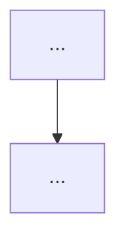

# <Task Title>

## User Goal

> Written by the user. Can be informal, any language, incomplete.
> Agent must NOT delete, overwrite, or alter this section.

证据账本机制已经验证了不太有效，在看case时发现crop工具的设计也得改改

因此当前优先级是基于s2.4b的实现

先重构 `semantic_crop` / `read_crop`，暂不处理 `index_video`。

### 背景判断

现有 `semantic_crop` 的核心问题是过于 **object-level**：

* 对目标 entity 做 grounding；
* 直接围绕 entity bbox 小幅扩张后裁剪；
* 视频输入实际上只是根据 `time_s` 抽取单帧，再执行 image crop。

这种设计会导致两个问题：

1. **丢失局部空间关系**

例如 golf ball、basketball player、vehicle 等目标被单独裁出后，hole、hoop、traffic cone 等 interaction partner 可能被裁掉。

但 ViSTR 一类任务真正需要判断的是：

* object-object relative position；
* interaction；
* motion toward / away from target；
* contact / collision；
* trajectory。

因此：

> semantic crop 不应该等价于 entity crop，而应该是 context-preserving local scene crop。

2. **视频被错误降维成单帧**

当前所谓 video crop 实际是：

`video + time_s → frame → crop image`

但期望的真正 video zoom-in 是：

`video temporal segment + spatial ROI → zoomed local video segment`

例如原视频中远处有一段投篮球事件，zoom-in 后应该得到一段新的局部视频，其中球员、篮球、篮筐都更清楚，同时保留它们的相对运动关系。

---

### 目标设计

#### 1. Crop 工具统一支持 Image 与 Video

希望两个工具均支持：

##### Image

`image → spatial crop → cropped image`

##### Video

`video + temporal range → spatial crop → cropped video clip`

即 video crop 不再退化成单帧 crop。

---

#### 2. `semantic_crop`

职责：

> 使用自然语言告诉系统“我要观察哪个局部场景”。

而不是：

> 把某个 entity 尽可能紧地抠出来。

建议接口类似：

```text
semantic_crop(
    path,
    target,
    start_s?,
    end_s?,
    anchor_s?
)
```

对于 image：

* semantic grounding；
* 构造 context-preserving ROI；
* 返回局部 image。

对于 video：

* 在指定 temporal segment 中定位目标；
* 根据多个时间点的 grounding 构造稳定的 local-scene ROI；
* 对整段视频使用该 ROI；
* 返回新的 zoomed video clip。

---

#### 3. `read_crop`

职责：

> 已知空间区域时，根据 bbox 直接读取该局部区域。

和 `semantic_crop` 的区别只应在“如何指定 ROI”：

* `semantic_crop`：natural-language semantic localization；
* `read_crop`：explicit bbox localization。

二者都应支持：

* image crop；
* video segment crop。

---

### Context-preserving Crop 原则

不能继续采用：

`entity bbox + 15% margin`

因为 tiny entity 会产生极小 crop，严重丢失空间上下文。

应该明确拆分：

`semantic localization bbox != final crop bbox`

流程应为：

```text
semantic localization
        ↓
target bbox / target evidence
        ↓
contextual ROI construction
        ↓
image/video crop
```

第一版可以先采用 task-agnostic 的简单策略：

* 在 video segment 内选若干 representative timestamps；
* 分别 ground target；
* 求这些 bbox 的 temporal union；
* 对 union bbox 做较大的 context expansion；
* 设置 minimum crop extent，避免 tiny-object crop；
* 整段视频使用同一个 stable ROI。

---

### Video Crop 的关键原则：Stable ROI

不要逐帧让 crop window 跟随 entity 居中。

否则目标自身的运动会被人为 camera motion 抵消，例如：

* approaching；
* moving left/right；
* moving toward hoop；
* relative displacement。

都会受到破坏。

因此第一版应采用：

`multiple-frame grounding → temporal union → one stable contextual ROI → crop whole temporal segment`

这样可以同时保留：

* entity motion；
* background reference；
* object-object relative geometry；
* temporal continuity。

暂时不需要上复杂 tracking。

---

### Interaction / Relation Preservation

最终目标不只是“保证 entity 周围多一点背景”，而是尽量保存局部 interaction scene。

例如：

* golf：`ball + hole + nearby green`
* basketball：`shooter + ball + hoop`
* traffic：`vehicle + cones + traversable region`

因此未来可进一步从：

`single-object grounding`

扩展到：

`multi-entity / relation-aware contextual region`

但第一阶段先通过 aggressive context expansion + minimum scene extent 解决最严重的问题。

---

### 输出形式

对于 video semantic crop，最好不仅返回若干图片，而是生成一个新的 video artifact，例如：

```text
source: video.mp4
time: 2.0–6.0s
ROI: [...]
zoomed video: zoomed_clip.mp4
```

同时可以附带少量 preview frames 方便 agent 快速确认 crop 是否正确。

生成的 `zoomed_clip.mp4` 应当继续作为普通 video 输入，允许 agent 递归使用：

* `read_video_sequence`
* `semantic_crop`
* `read_crop`
* 后续 `index_video`

从而形成：

`video → local video → finer local video`

的递归视觉探索能力。

---

### 当前非目标

本轮先不要：

* 重构 `index_video`；
* 增加 trajectory-specific tool；
* 增加 speed / physics solver；
* 增加 DA3 / VGGT / SAM2；
* 把 crop 做成 task-specific workflow；
* 强制固定的推理流程。

核心目标仍然是保持 4D-Agent / Pi harness 的开放探索能力，只改进底层 **task-agnostic observation primitive**。

### 当前最高优先级

> 将现有的 **object-level single-frame crop** 重构为 **context-preserving image/video spatial-temporal zoom primitive**，避免 zoom-in 本身破坏相对位置、运动和 interaction 信息。


## For Agent: Execution Protocol

1. Read and follow `docs/agent/always.md`.

2. Based on **User Goal**, fill in:
   - `Agent Refined Plan`
   - `Required Agent Resources`
   - `Acceptance Criteria`

3. To find available Rules, Skills, or Playbooks, check:
   - `docs/registry/agent_system.md`
   - Do not load everything — only what's relevant.

4. When refining:
   - User Goal is the highest source of truth.
   - Do not omit any explicit user requirement.
   - Do not expand scope beyond what was asked.
   - Non-blocking side issues: note them, don't pursue them.
   - If there's ambiguity, danger, or high cost: ask the user first.

5. After implementation and verification, fill in the **Execution Report**.

6. Before user approval:
   - Set status to `awaiting_approval`, not `completed`.
   - Do not archive the plan.
   - Do not describe experimental results as final conclusions.

7. After user approval, complete this **archival checklist** (do not skip):
   - [ ] Update status to `completed`, move to `plans/completed/`.
   - [ ] Update `docs/working_logs/active.md`.
   - [ ] **Register new assets**: new scripts → `registry/scripts.md`; new data/outputs → `registry/outputs.md` or `registry/datasets.md`.
   - [ ] **Register new agent resources**: new rules/skills/playbooks → `registry/agent_system.md`.
   - [ ] If document structure changed, update `docs/README.md`.
   - [ ] If an experiment was run, write a run log to `working_logs/runs/`.
   - [ ] **Evaluate Code Map**: per `rule:human-code-review`, decide if this implementation needs a new or updated `docs/code_maps/` document.

## Agent Refined Plan

### Understanding

<!-- Agent's interpretation of the task, in a few sentences -->

### Scope

#### In Scope

- ...

#### Out of Scope

- ...

### Steps

1. ...
2. ...
3. ...

## Required Agent Resources

### Rules

- ...

### Skills

- ...

### Playbooks

- ...

## Acceptance Criteria

- [ ] ...
- [ ] ...
- [ ] ...

---

## Execution Report

### Summary

- ...

### Changed Files

| File | Change |
|------|--------|

### Commands

```bash
# Key commands executed
```

### Verification Results

```text
# Output and conclusions
```

### Outputs

- ...

### Remaining Issues

- ...

### Human Review Guide

#### What changed conceptually

- ...

#### Execution flow



#### Core pseudocode

```text
...
```

#### Key code pointers

* `path/file.py:function_name`

#### Code maps created/updated

* (link to new or updated code map, or N/A)

### Suggested Next Step

- ...
