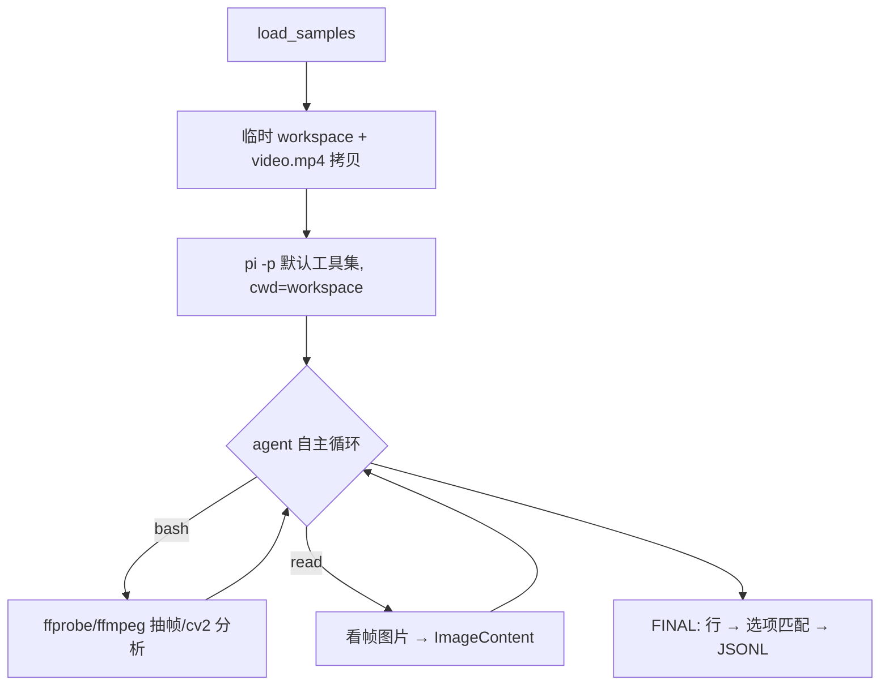

# pi 作为 harness — Stage 2 原生工具拉通

## User Goal

> Written by the user. Can be informal, any language, incomplete.
> Agent must NOT delete, overwrite, or alter this section.

前置任务`/mnt/xlab-nas-wm/gaozhe.gz/codes/PlayGround/0731-spatial_temperal_agent/docs/working_logs/plans/completed/0806-[pi作为harness]stage1-拉通.md`

现在我想尝试：
1. 启用白板pi的自带的工具，代码空间作为agent活动的大世界.
2. 主要需要让vlm/agent知道source视频的路径

全量跑下eval吧

## For Agent: Execution Protocol

1. Read and follow `docs/agent/always.md`.

2. Based on **User Goal**, fill in:
   - `Agent Refined Plan`
   - `Required Agent Resources`
   - `Acceptance Criteria`

3. To find available Rules, Skills, or Playbooks, check:
   - `docs/registry/agent_system.md`
   - Do not load everything — only what's relevant.

4. When refining:
   - User Goal is the highest source of truth.
   - Do not omit any explicit user requirement.
   - Do not expand scope beyond what was asked.
   - Non-blocking side issues: note them, don't pursue them.
   - If there's ambiguity, danger, or high cost: ask the user first.

5. After implementation and verification, fill in the **Execution Report**.

6. Before user approval:
   - Set status to `awaiting_approval`, not `completed`.
   - Do not archive the plan.
   - Do not describe experimental results as final conclusions.

7. After user approval, complete this **archival checklist** (do not skip):
   - [ ] Update status to `completed`, move to `plans/completed/`.
   - [ ] Update `docs/working_logs/active.md`.
   - [ ] **Register new assets**: new scripts → `registry/scripts.md`; new data/outputs → `registry/outputs.md` or `registry/datasets.md`.
   - [ ] **Register new agent resources**: new rules/skills/playbooks → `registry/agent_system.md`.
   - [ ] If document structure changed, update `docs/README.md`.
   - [ ] If an experiment was run, write a run log to `working_logs/runs/`.
   - [ ] **Evaluate Code Map**: per `rule:human-code-review`, decide if this implementation needs a new or updated `docs/code_maps/` document.

## Agent Refined Plan

### Understanding

Stage 1 中 pi 只是问答通道(帧直接贴对话,411 session 0 次工具调用)。Stage 2 反转:
不预抽帧,给 agent 一个**空工作目录 + 源视频路径**,启用 pi 全部原生工具
(bash/read/edit/write/grep/find/ls),让 VLM 自主用 bash(ffmpeg / cv2)抽帧、
用 read 工具看图,再作答。全量跑 dev 403(用户已明确要求)。

关键前提已验证:
- pi 的 read 工具原生支持图片(返回 ImageContent 给 VLM,自动 resize ≤2000px)
- print 模式工具执行无需审批(trust 只管 project-local 资源)
- 环境有 ffmpeg(/usr/local/bin)+ /opt/conda/bin/python(cv2 5.0)

### Scope

#### In Scope

- `agent/eval_pi_agentic.py`:每样本建临时 workspace,拷入视频,prompt 告知视频路径 + 可用工具链,pi -p 默认工具集运行;答案用 `FINAL: <选项>` 行解析
- 冒烟(2-3 样本)验证轨迹确实发生工具调用(bash 抽帧 + read 看图)
- 全量 dev 403(4 workers,后台)
- run log + 文档收尾

#### Out of Scope

- sandbox / 容器隔离(用户仍未要求;bash 在临时目录直跑)
- 自定义 pi extension / 专用分析工具注入(后续阶段)
- prompt 调优迭代(本阶段只拉通,一版 prompt 定终身)

### Steps

1. 写 `agent/eval_pi_agentic.py`(复用 load_samples / 打分 / resume / workers 骨架)
2. 冒烟 2-3 样本,检查 session 轨迹:有 bash + read 工具调用、FINAL 行可解析
3. 全量 dev 403 后台运行(nohup -u + monitor)
4. run log → `working_logs/runs/`,填 Execution Report,status → awaiting_approval

## Required Agent Resources

### Rules

- `docs/agent/always.md`(key 安全、public split only、nohup -u、run log)

### Skills

- 无

### Playbooks

- 无

## Acceptance Criteria

- [ ] 冒烟轨迹中出现真实工具调用(bash 抽帧、read 读图)
- [ ] FINAL 行解析成功率高(无法解析样本 < 5%)
- [ ] 全量 dev 403 跑完,产出 JSONL + run log,与 Stage 1 (54.6%) 对比
- [ ] key 不入 repo;视频只读(workspace 内是拷贝)

---

## Execution Report

### Summary

- 发现并修复关键兼容 bug:AMAP 网关流式 tool-call `arguments` 为**累积式**(每 chunk 全量前缀),
  非 OpenAI 标准增量;pi 直接拼接导致工具参数乱码(如 `"ff{"`),agent 完全无法调工具。
  补丁 `scripts/patch_pi_cumulative_args.py`(自适应两种格式,npm 重装后重跑即可)
- `agent/eval_pi_agentic.py`:每样本临时 workspace + video.mp4 拷贝,pi 默认工具集自主分析,`FINAL:` 行解析
- 全量 dev **53.8% (217/403)**,0 error,1 parse-fail;agent 平均 14.7 轮/13.9 次工具调用/看 6.2 帧

### Changed Files

| File | Change |
|------|--------|
| `agent/eval_pi_agentic.py` | 新增:Stage 2 agentic 评测脚本 |
| `scripts/patch_pi_cumulative_args.py` | 新增:pi-ai 累积式 tool-call args 兼容补丁 |
| `third_party/pi-runtime/.../openai-completions.js` | 已打补丁(repo 外,gitignored) |

### Commands

```bash
# 补丁(npm 重装后需重跑)
/opt/conda/bin/python scripts/patch_pi_cumulative_args.py

# 冒烟
/opt/conda/bin/python -u agent/eval_pi_agentic.py --limit 2 --output outputs/predictions/pi_agentic_smoke.jsonl

# 全量
nohup /opt/conda/bin/python -u agent/eval_pi_agentic.py --split dev --workers 4 --resume \
  --output outputs/predictions/pi_agentic_qwen3-vl-plus_dev_20260806.jsonl > outputs/predictions/pi_agentic_dev_20260806.log 2>&1 &
```

### Verification Results

```text
补丁前: 所有 toolCall arguments 截断为 "ff{"/"ls{",agent 20 轮全部失败
补丁后冒烟: 轨迹正常(ffprobe → ffmpeg 抽帧 → read 看图 → 裁剪 → FINAL)
网关 raw chunk 验证: arguments 字段确认为累积式(全量前缀重发)

全量 dev: 217/403 = 53.8%, 0 errors, 1 parse-fail, 95s/样本 (2.7h, 4 workers)
vs Stage 1 (54.6%): 总体 -0.8pp,但互补性强:
  S2-only 对 69 题, S1-only 对 72 题 → union oracle 71.7%
  受益: Basketball +11pp, Swimming +9, Jenga +9, Passage +6 (关键瞬间类)
  受损: Relative_Velocity -28pp, Knot -12, Fall -7 (整体运动感知类)
```

### Outputs

- `outputs/predictions/pi_agentic_qwen3-vl-plus_dev_20260806.jsonl`(403 条)
- `outputs/predictions/pi_agentic_smoke.jsonl`(冒烟)
- run log: `docs/working_logs/runs/2026-08-06_pi_stage2_agentic_dev.md`

### Remaining Issues

- **Relative_Velocity 崩塌 (-28pp)**:agent 逐帧看图丢失运动感知;Stage 1 的 8 帧直贴反而有"速度直觉"
- **"Yes" bias 加重**(pred Yes 65% vs gt 56%):agent 看到证据后倾向确认假设
- 补丁在 gitignored 的 node_modules 内,npm 重装会丢——补丁脚本已入 repo,但需记得重跑
- 成本:~15 轮/题,token 约 Stage 1 的 10 倍
- `~/.pi/agent/sessions/` 已积累 ~570 个 session(含图片,单个可达数 MB),需定期清理

### Human Review Guide

#### What changed conceptually

- Stage 1"把帧塞给模型" → Stage 2"给模型视频和工具,让它自己找证据"
- pi 第一次真正作为 coding agent 工作:多轮 bash/read 循环,workspace 即世界

#### Execution flow



#### Core pseudocode

```text
for sample in dev:
    ws = tmpdir(); copy(video, ws/video.mp4)
    out = run([pi, -p, --provider amap-gateway, --model qwen3-vl-plus,
               PROMPT(question, options)], cwd=ws, timeout=600)
    pred = last "FINAL: xxx" line → option match; fallback: tail substring
```

#### Key code pointers

* `agent/eval_pi_agentic.py:solve_agentic` — workspace + pi 子进程
* `agent/eval_pi_agentic.py:parse_final` — FINAL 行解析
* `scripts/patch_pi_cumulative_args.py` — 累积式 args 兼容补丁(核心 diff 在 NEW 常量)

#### Code maps created/updated

* N/A(脚本结构同 eval_pi.py;补丁脚本自文档化)

### Suggested Next Step

- **混合路由**(最有希望):速度/运动感知类任务走 Stage 1,关键瞬间判定类走 Stage 2;union oracle 71.7% 说明融合上限很高
- 或改 Stage 2 prompt:强制先生成多帧网格总览(montage)再局部细看,补回运动感知
- 上游反馈:向 pi 提 issue(累积式 streaming 兼容)避免长期维护本地补丁

