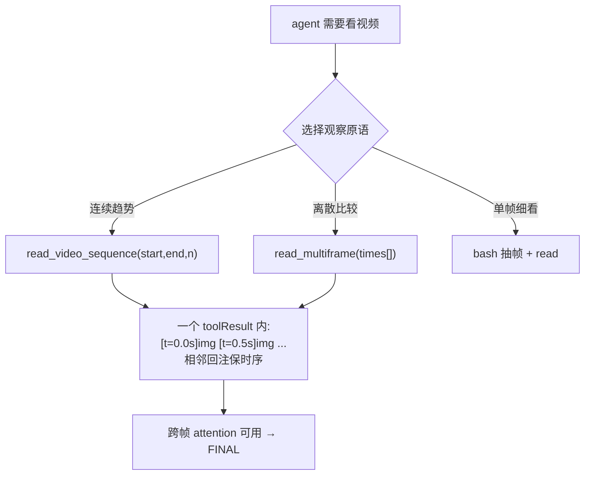

# pi 作为 harness — Stage 2.1 多图阅读工具(时序观察原语)

## User Goal

### 第一阶段

> Written by the user. Can be informal, any language, incomplete.
> Agent must NOT delete, overwrite, or alter this section.

当前 Pi 版本虽然比固定式 spatial harness 更自由，但实际跑 ViSTR 时发现 Agent 经常把视频当成一组独立图片处理：一次只 read 一张图，再基于少量静态帧做判断。这会损失连续时序信息，尤其不利于速度、运动趋势、旋转、轨迹变化等需要跨帧比较的任务。

本阶段不希望通过加入 ViSTR-specific prompt、固定任务路由或额外 reasoning skill 来“教模型该怎么看”，而是优先修正 Pi 当前偏单帧的视觉 observation interface。目标是在保留原生 read 的基础上增加两个通用读取原语：
- read_video_sequence：一次读取并查看一个连续视频时间片段；
- read_multiframe：一次读取并联合查看多个指定时刻/帧，用于跨帧比较。

两个工具应保持 task-agnostic，只负责提供更自然的时序视觉观察能力，不内置速度判断、轨迹分析、任务分类等领域知识。希望观察在不额外约束 Agent 推理流程的情况下，仅通过改善 observation affordance，是否能自然减少“一次只看一张图”的行为，并形成更合理的时空理解轨迹。

（个人结论：当前两个工具分的不够开，multi frame工具没达到我的预期）

### 第二阶段

第一阶段已经证明，多图一次回注可以明显减少 Agent“一次只看一张图”的行为，但目前 `read_video_sequence` 和 `read_multiframe` 的功能仍然过于相似：前者是在一个连续区间内均匀抽帧，后者只是由 Agent 手动指定若干 timestamp；如果这些 timestamp 本身也是均匀选取，两者得到的信息几乎没有区别。因此当前 `read_multiframe` 还没有达到最初预期。

第二阶段希望重新明确两种 observation primitive 的职责：
- `read_video_sequence`：用于**看一个连续过程**。输入一个时间区间，由工具在区间内按时间顺序采样多帧并一次性返回，核心是保持局部时间连续性。
- `read_multiframe`：用于**联合查看已经选出的若干关键帧/证据帧**。这些帧不要求连续或均匀分布，而应来自前置的 evidence selection，例如根据视频内容的粗粒度 caption / index / search 找到若干语义上重要的时刻，再一次性送入 `read_multiframe` 比较。

因此，后续可增加一个轻量、task-agnostic 的视频帧索引/语义检索能力，负责“从视频里找到可能值得看的帧”；`read_multiframe` 本身只负责把这些已经选中的帧放在同一个视觉上下文中读取，不把“选什么帧”和“怎么看这些帧”塞进同一个工具。

最终希望把视觉观察接口明确拆成三种基本原语：`read` 看单个时刻，`read_video_sequence` 看连续过程，`read_multiframe` 看离散但有语义价值的一组证据时刻。仍然不加入 ViSTR-specific task routing、速度/轨迹判断等领域逻辑，重点观察更清晰的 observation action space 是否会让 Agent 自主形成更合理的时序探索策略。


### 第三阶段

第二阶段之后，除了“时间上怎么读视频”，还发现了一个类似的空间观察问题：Agent 虽然能大致看出目标在画面什么位置，但目前通常是先用自然语言描述“在下方偏左/靠近手部”，再结合 ffprobe 得到的原始分辨率，在文本 reasoning 里自己换算像素坐标，最后用 ffmpeg crop；如果裁偏了，再 read 裁剪结果继续调整。这个过程说明模型本身有一定 grounding 能力，但当前 Pi 没有把这种能力提供成一个直接、稳定的视觉 action primitive，导致大量不必要的坐标算术和 bash 操作。

第三阶段希望参考 DeepEyes 一类 **self-grounding → crop → re-observe** 的思路，给 Pi 增加一个非常薄、task-agnostic 的空间读取原语，例如 `read_crop` / `zoom_image`：

* Agent 自己根据当前看到的图片判断需要进一步查看哪个区域，并输出 bbox；
* bbox 使用统一的 normalized coordinate system（例如 `[0,1000]`），不让模型自己根据 1080×1920、2560×1440 等分辨率计算真实像素；
* tool 只负责把 normalized bbox 映射到原图、裁剪原始高分辨率图像，并把 crop 后的图片重新返回给同一个 Agent；
* 如果第一次 grounding 不准，Agent 可以根据返回的 crop 自己再次调整 bbox，形成 `ground → crop → re-observe → refine` 的闭环。

 本阶段暂时不加入 Grounding-DINO、目标检测器、手部检测器等外部 grounding expert，也不加入 Jenga、车辆、人物等 task-specific 定位逻辑。目的不是让工具替模型“找目标”，而是把模型本身已有但目前只能通过“视觉估计 + 像素算术 + bash crop”间接使用的 grounding 能力，变成一个可直接执行的 observation action。

 希望最终把 Pi 的基础视觉观察能力进一步拆清楚：
* `read`：看单张完整图片；
* `read_crop / zoom_image`：对单张 observation 做空间上的主动局部再观察；
* `read_video_sequence`：看一个连续时间过程；
* `read_multiframe`：联合查看已经选出的多个离散证据帧。

仍然保持“先补 observation affordance，不教具体任务解法”的原则。重点观察加入 self-grounding spatial primitive 后，Agent 是否会自然减少手写 ffmpeg crop 和像素坐标计算，并能通过多轮 zoom / refine 更稳定地获取局部视觉证据。

(阶段性反馈：crop很不准，training-free的情况下得外挂模型)

### 第四阶段

> 第三阶段的 `read_crop` 仍要求主 Agent 自己根据视觉内容生成 bbox。实际运行发现首轮 grounding 不稳定，模型经常在 reasoning 中进行分辨率、像素和 normalized coordinate 的换算，再通过多轮 crop → read → 调坐标补救。这个过程占用了大量主 Agent reasoning，而且“找到目标在哪里”和“读取目标内容”两个职责混在了一起。
>
> 第四阶段希望把 spatial grounding 从主 Agent 的坐标推理中剥离出来，改为一个独立、task-agnostic 的 `semantic_crop`：**主 Agent 只描述自己想看什么，grounding backend 负责把这个语义需求稳定地变成空间区域。**
>
> 首先需要持久化部署一个独立的视觉模型池 / perception service。第一阶段至少包含 **GroundingDINO**，模型权重在服务启动时一次加载并常驻 GPU，之后不同 Pi episode 通过 HTTP/RPC 复用，不能每次 tool call 或每个 benchmark sample 重新启动模型、重新加载权重。后续 DA3、VGGT、SAM2 等视觉模型也可以沿用同一 model-pool/service 结构，但本阶段只要求先把 GroundingDINO 跑通。
>
> GroundingDINO 的职责不是直接回答 ViSTR 问题，而只是根据图片和文本 concept/referring expression 产生候选 bbox、score 和 phrase。例如主 Agent 希望查看 `"the hand touching the lower tower"`，grounding service 可以围绕 `hand / block / tower` 等语义生成若干空间候选。
>
> `semantic_crop` 的目标接口尽量简单：
>
> ```text
> semantic_crop(
>     path="frame.jpg",
>     target="the hand touching the lower part of the tower"
> )
> ```
>
> 视频帧则允许：
>
> ```text
> semantic_crop(
>     path="video.mp4",
>     time_s=1.8,
>     target="the vehicle inside the green box"
> )
> ```
>
> 主 Agent 不再提供 bbox，也不负责像素或 normalized coordinate 换算。
>
> 工具内部第一版采用固定、training-free 的 grounding pipeline：
>
> ```text
> image + semantic target
>         ↓
> GroundingDINO service
>         ↓
> top-K candidate bboxes
>         ↓
> 在全图上画 candidate ID
>         ↓
> grounding VLM subcall
>         ↓
> 根据原始 target 选择 candidate ID
>         ↓
> 直接使用选中的 bbox
>         ↓
> 从原始高分辨率图片确定性 crop
>         ↓
> 返回 grounding receipt + high-resolution crop
> ```
>
> 这里 VLM 的职责是 **candidate selection，而不是 bbox regression**。即 GroundingDINO 负责提供空间上准确的候选框，VLM 只判断“这些候选里哪个最符合语义需求”，避免再次退化成模型自己调整 x/y 坐标。
>
> grounding VLM subcall 必须与 benchmark reasoning 隔离：只允许看到当前图片、带编号的候选框和 `target` referring expression，不能看到原始 ViSTR question、options 或当前答案假设，避免它成为隐藏的第二个 task solver。
>
> 对于复杂 referring expression，不要求 GroundingDINO 本身完整理解关系语义。例如：
>
> ```text
> "the hand touching the lower tower"
> ```
>
> 可以由 GroundingDINO 提供多个 `hand` / 相关 object candidate，再由 VLM 根据完整 referring expression 选择正确区域。第一版不要让 VLM选完候选后再输出一个新的 bbox。
>
> `semantic_crop` 返回至少包括：
>
> * 最终选择的 candidate / bbox；
> * GroundingDINO confidence / phrase 等基础 grounding 信息；
> * 一张低成本 grounding receipt：原图缩略图上画出最终选中的 bbox；
> * 从原始高分辨率图像裁出的局部图。
>
> grounding receipt 用于让主 Agent检查 semantic grounding 是否明显选错。如果选错，Agent 应通过修改 semantic target 后重新调用，例如：
>
> ```text
> "the hand"
> →
> "the left hand touching the lowest red block"
> ```
>
> 而不是重新进行 bbox 数值调整。
>
> GroundingDINO 服务应作为独立长期进程存在，而不是 Pi extension 内部直接 import / load 大模型。建议结构：
>
> ```text
> ┌──────────────── Pi episode / sandbox ────────────────┐
> │                                                     │
> │  Main VLM → semantic_crop extension                 │
> │                        │                            │
> └────────────────────────┼────────────────────────────┘
>                          │ HTTP / RPC
>                          ▼
>             ┌──── Persistent Model Pool ────┐
>             │                               │
>             │ GroundingDINO  [GPU resident] │
>             │ SAM2          [future]        │
>             │ DA3           [future]        │
>             │ VGGT          [future]        │
>             │ ...                           │
>             └───────────────────────────────┘
> ```
>
> model pool 至少需要提供稳定的 health check、模型 lazy/eager loading 状态、统一输入输出 schema 和错误信息。本阶段只真正部署 GroundingDINO，但接口设计不要写死成只能服务单一模型，方便后续扩展其他 perception backend。
>
> 第一版暂时不加入 SAM2 refinement。当前目标是得到**包含目标及必要上下文的可靠 crop**，而不是 pixel-perfect segmentation；过紧的 mask/crop 反而可能损失“手是否接触积木”“车与周围物体关系”等上下文。GroundingDINO bbox 可使用固定的小幅 context margin，但必须是工具层统一规则，不允许根据 ViSTR task 动态调整。
>
> 原来的 `read_crop` 暂时保留，作为 self-grounding baseline：
>
> ```text
> read_crop
>     = 主 Agent自己回归 bbox → crop
>
> semantic_crop
>     = 主 Agent给 semantic intent
>       → GroundingDINO proposals
>       → VLM candidate selection
>       → deterministic crop
> ```
>
> 后续重点比较：
>
> * first-hit grounding / crop 成功率；
> * 平均需要多少次 crop/refine；
> * 主 Agent trajectory 中坐标算术和手写 ffmpeg crop 是否明显减少；
> * grounding tool calls / latency；
> * GroundingDINO proposal recall；
> * VLM candidate selection error；
> * 最终任务准确率变化。
>
> 本阶段仍然坚持 task-agnostic 原则：不加入 Jenga、Vehicle、Fall Direction 等任务专用 detector、routing 或 reasoning rule。要验证的是：**用一个持久化的通用 perception backend，把 semantic intent → precise spatial evidence 变成 harness 的基础能力，是否比让通用 VLM在主 reasoning 中自己做坐标 grounding 更可靠。**
>
> 本阶段先完成 GroundingDINO model pool/service、`semantic_crop` extension 和小规模 grounding 验证；不要直接跑全量 ViSTR，也暂时不要同时部署 SAM2、DA3、VGGT，避免一次引入过多变量。

我还建议你给 CC **额外钉一句工程约束**，不然它很可能偷懒直接在 extension 里 `from groundingdino import ...`：

> GroundingDINO 必须作为独立常驻服务部署，extension 里禁止加载模型权重。我要的是后续可以容纳 GroundingDINO / SAM2 / DA3 / VGGT 的共享 perception model pool，而不是一个仅服务当前 tool 的临时 Python subprocess。模型初始化成本只能发生在 service startup / 首次 lazy load，不能发生在每个 sample 或每次 tool call。


### 第四阶段 Execution Report(2026-08-07)

**已交付**:
- `scripts/perception_service.py` — 常驻 perception model-pool(Flask :7876,GPU MI308X):
  GroundingDINO(HF transformers 实现,权重 `hf_datasets/grounding-dino-base`)启动即加载常驻;
  `/health` `/ground`(候选框+编号标注图)`/annotate`(receipt);registry 结构可扩 SAM2/DA3/VGGT。
  **extension 内零权重加载**,只走 HTTP(工程约束落实)
- `semantic_crop` 工具(extension):target(英文 referring expression,中文会变 [UNK] 已在
  description 约束)→ GroundingDINO top-6 候选 → 编号标注图 → **隔离 VLM subcall 选 ID**
  (只见候选图+target,不见题目)→ 固定 15% margin 原图裁剪 → receipt + 高清 crop 回注
- `scripts/grounding_probe.py` — 5 个 task-agnostic 探针(篮筐/手触塔/绿框车/泳者/母球)
  对比两种 grounding

**验证结果(同 5 探针,qwen3-vl-plus 主 agent)**:

| 指标 | read_crop(自回归 bbox) | semantic_crop |
|------|----|----|
| 平均调用次数 | 3.2(最差 7) | **1.4**(4/5 首发命中) |
| 平均耗时 | 40s | **28s** |
| 坐标算术 | 有 | 无 |

人工抽查 crop 质量:篮筐/手触塔/泳者均精准(GroundingDINO 连 43px 的球都能框)。
S2.3 期间 read_crop 的 28% miss 信号问题在 semantic_crop 路径上基本消失。

**遗留**:
- GroundingDINO 文本词表仅英文;service 常驻依赖手工启动(建议后续加 systemd/supervisor)
- 未跑 ViSTR 评测(按计划本阶段只做 grounding 验证;S2.4 评测待用户指令)
- selection subcall 用 qwen3-vl-plus,偶发多候选混淆(probe 114 用了 3 次)

**S2.4 评测补记(2026-08-07,用户指令跑 90 题)**:
- 首轮 S2.4 = 44.4%(回落)→ 归因:user prompt 工具清单漏列 semantic_crop,
  85 session 仅调 5 次。教训已入 `knowledge/pi_harness.md` §3(pi 会把 extension 工具
  promptSnippet 动态入 system prompt,但 user prompt 不完整枚举会压制发现)
- 修复清单后重跑 **S2.4b = 56.7% (51/90),系列最佳,首超 SpatialClaw 53.3%**;
  semantic_crop 118 次调用(39% 题采用)
- 同 90 题: Claw 53.3 | S1 52.2 | S2 50.0 | S2.1 51.1 | S2.2 51.1 | S2.3 48.9 | **S2.4b 56.7**
- 亮点: Mikado 6/6、Billiards/Ego/Interaction 5/6;顽固弱项: Fall/RelVel/Vehicle 1/6(运动感知)
- 输出: `outputs/predictions/pi_agentic_ext4b_qwen_pt6_20260807.jsonl`

## For Agent: Execution Protocol

1. Read and follow `docs/agent/always.md`.

2. Based on **User Goal**, fill in:
   - `Agent Refined Plan`
   - `Required Agent Resources`
   - `Acceptance Criteria`

3. To find available Rules, Skills, or Playbooks, check:
   - `docs/registry/agent_system.md`
   - Do not load everything — only what's relevant.

4. When refining:
   - User Goal is the highest source of truth.
   - Do not omit any explicit user requirement.
   - Do not expand scope beyond what was asked.
   - Non-blocking side issues: note them, don't pursue them.
   - If there's ambiguity, danger, or high cost: ask the user first.

5. After implementation and verification, fill in the **Execution Report**.

6. Before user approval:
   - Set status to `awaiting_approval`, not `completed`.
   - Do not archive the plan.
   - Do not describe experimental results as final conclusions.

7. After user approval, complete this **archival checklist** (do not skip):
   - [ ] Update status to `completed`, move to `plans/completed/`.
   - [ ] Update `docs/working_logs/active.md`.
   - [ ] **Register new assets**: new scripts → `registry/scripts.md`; new data/outputs → `registry/outputs.md` or `registry/datasets.md`.
   - [ ] **Register new agent resources**: new rules/skills/playbooks → `registry/agent_system.md`.
   - [ ] If document structure changed, update `docs/README.md`.
   - [ ] If an experiment was run, write a run log to `working_logs/runs/`.
   - [ ] **Evaluate Code Map**: per `rule:human-code-review`, decide if this implementation needs a new or updated `docs/code_maps/` document.

## Agent Refined Plan

### Understanding

S2 轨迹实测:87% 看图轮次一次只 read 1 张、0 次自发拼图 → 时序信息在"独立 toolResult +
中间隔着分析文本"的回注方式下丢失(Relative_Velocity 68%→40% 的机制)。
本阶段用 pi extension(`pi.registerTool`)为 agent 增加两个 **task-agnostic 时序观察原语**:

- `read_video_sequence(path, start_s, end_s, max_frames?)` — 读取连续时间片段,均匀抽帧,
  多张图在**同一个 toolResult 里相邻回注**(带时间戳标注)
- `read_multiframe(path, times_s[])` — 读取多个指定时刻,联合查看用于跨帧比较

不做:ViSTR-specific prompt、任务路由、领域分析逻辑(速度/轨迹判断等)。
观察目标:仅改善 observation affordance,单帧行为是否自然减少、时序任务是否回升。

### Scope

#### In Scope

- `agent/pi_ext/vistr_video_tools.ts` — pi extension,注册两个工具
  (node child_process 调 ffmpeg 抽帧,640px/jpeg,单次调用帧数上限控制 token)
- `eval_pi_agentic.py` 加 `--extension` 参数(透传 pi `-e`);user prompt 仅中性地
  把两个新工具列入"可用手段"清单(与现有 read/bash 的列举方式一致,无用法指导)
- 冒烟验证:工具被注册进 tools schema、返回多图、模型能调用
- 按新约定:`--per-task 6`(90 题)抽样对比 S2 基线,不跑全量
- 轨迹统计:多图工具使用率 vs 单帧 read 率

#### Out of Scope

- 全量 dev 评测(除非用户明确要求)
- prompt 教学/任务分类/reasoning skill
- opus(费用高,先用 qwen3-vl-plus 对齐 S2 基线)

### Steps

1. 写 extension:两工具 + ffmpeg 抽帧 + 多图 content 回注(每帧前插时间戳 text 块)
2. `pi -p -e <ext.ts>` 冒烟:确认注册成功、单次调用返回多图、qwen 能正确调用
3. `eval_pi_agentic.py --extension` 支持 + prompt 中性列举
4. `--per-task 6`(90 题)跑 S2.1,与 S2 基线同子集对比 + 工具使用率统计
5. 填 Execution Report → awaiting_approval

### 第二阶段 Refined Plan(2026-08-07,用户已确认设计)

**职责拆分**:`read` 看单时刻 / `read_video_sequence` 看连续过程 /
`read_multiframe` 联合看已选出的证据帧(不要求均匀);新增第四原语:

- **`index_video(path, num_frames≤12)`**:低频均匀采样 → **一次 batch VLM 请求**生成
  `t=X.XXs: <简短客观 caption>` 文本时间线。硬约束(用户指定):
  - caption 调用**不携带当前题目**,不做任务相关筛选、不做答案推理
  - 只给 semantic timeline,选帧决策留给 agent → read_multiframe
  - 暂不加运动能量/场景切换索引(避免多变量)

实现:extension 内 fetch 网关(读 `~/.pi/agent/models.json` 的 amap-gateway 配置,
非流式);帧 480px/q60 控成本;`read_multiframe` description 改写为"联合查看已选出的
证据帧,通常在 index_video 之后使用"(仍 task-agnostic)。

步骤:实现 → 冒烟 → `--per-task 6` 90 题(S2.2)对比 S2.1/S2 + 工具链使用统计
(index_video→read_multiframe 的组合率)。

### 第三阶段 Refined Plan(2026-08-07)

**新原语 `read_crop`**(DeepEyes 式 self-grounding → crop → re-observe,不引入外部检测器):

- 参数:`path`(图片或视频)、`bbox=[x0,y0,x1,y1]`(**normalized [0,1000]**,模型不做像素算术)、
  `time_s`(path 为视频时必填,从**原始分辨率**帧上裁)
- 工具职责:ffprobe 拿真实宽高 → bbox 映射到原图 → 裁剪 → 图片回注;
  裁偏了 agent 自行 refine(ground→crop→re-observe 闭环)
- 设计要点:从原始分辨率裁(解决 640px 缩放帧看不清穿网/支撑关系的幻觉问题,#753/#1082 实证)
- 不做:Grounding-DINO/检测器/任务定位逻辑

观察指标:bash-ffmpeg-crop 手工操作是否消失、read_crop 采用率与 refine 轮数、
`--per-task 6` 90 题(S2.3)对比 S2.2。

## Required Agent Resources

### Rules

- `docs/agent/always.md`(评测默认均匀抽样;费用敏感)

### Skills

- 无

### Playbooks

- `docs/knowledge/pi_harness.md`(extension 机制、§3.4.1 单帧问题)

## Acceptance Criteria

- [ ] 两工具注册成功且 task-agnostic(无领域逻辑)
- [ ] 单次调用可返回多张相邻图(带时间戳),token 可控(默认 ≤8 帧/次)
- [ ] 90 题(--per-task 6)跑通,与 S2 基线同子集对比
- [ ] 轨迹统计:多图工具使用率、"单帧 read"占比变化
- [ ] 时序类任务(Relative_Velocity/Rotation/Vehicle)有可观察的行为或准确率变化

---

## Execution Report

### Summary

- `agent/pi_ext/vistr_video_tools.ts`:pi extension 注册 `read_video_sequence` +
  `read_multiframe`,多帧带时间戳在**同一 toolResult 相邻回注**;task-agnostic,无领域逻辑
- `eval_pi_agentic.py` 支持 `VISTR_PI_EXTENSION`(透传 pi `-e`),prompt 仅中性列举新工具
- 90 题均匀子集(--per-task 6,遵守新抽样约定)评测:**行为改变显著,准确率微升**

### Changed Files

| File | Change |
|------|--------|
| `agent/pi_ext/vistr_video_tools.ts` | 新增:两个时序观察工具(ffmpeg 抽帧,≤8 帧/次,640px) |
| `agent/eval_pi_agentic.py` | `VISTR_PI_EXTENSION` 支持 + src 标记 `pi_agentic_ext` |
| `agent/eval_{baseline,pi,pi_agentic}.py` | `--per-task N` 均匀抽样(本阶段顺带,用户新约定) |

### Commands

```bash
# 冒烟
pi -p -e agent/pi_ext/vistr_video_tools.ts --provider amap-gateway --model qwen3-vl-plus "..."
# 评测(90 题)
VISTR_PI_EXTENSION=$PWD/agent/pi_ext/vistr_video_tools.ts \
  /opt/conda/bin/python -u agent/eval_pi_agentic.py --split dev --per-task 6 --workers 4 --resume \
  --output outputs/predictions/pi_agentic_ext_qwen_pt6_20260807.jsonl
```

### Verification Results

```text
冒烟: read_video_sequence 单次回注 6 张相邻带时间戳图 ✓
修复: t=duration 时 ffmpeg 抽不出帧 → clampT(dur-0.1s)

90 题同子集对比 (qwen3-vl-plus):
  S1 52.2% | S2 50.0% | S2.1 51.1% (+1.1pp vs S2)
行为统计 (157 session):
  90/157 session 用了新工具; read_video_sequence 161 次 + read_multiframe 89 次
  单帧 read 轮占比: 87% (S2) → 14% (S2.1)
  耗时: 95s → 64s/样本 (轮数减少)
分任务: Knot +3, Billiards +2, Relative_Velocity +1; Golf -2, Soccer -2
```

### Outputs

- `outputs/predictions/pi_agentic_ext_qwen_pt6_20260807.jsonl`(90 条)

### Remaining Issues

- 90 题下 ±5pp 在噪声内,准确率结论需更大样本(或全量,待用户决定)
- 预测类(Golf/Soccer)看多帧后更犹豫、答错更多——多帧利用质量成为新瓶颈
- extension 里 `promptGuidelines` 未设置——是否给"跨帧比较优先用 read_multiframe"级别的
  中性引导,留给用户判断(可能违反"不教模型怎么看"的原则)

### Human Review Guide

#### What changed conceptually

- 观察接口从"单图 read"升级为"时序切片/多时刻联合查看"——修 affordance,不修推理
- 效果:单帧行为 87%→14%,行为面完全达成;准确率面增益尚小

#### Execution flow



#### Core pseudocode

```text
read_video_sequence(path, start, end, n):
    dur = ffprobe(path); times = linspace(clamp(start), clamp(end), n≤8)
    content = [meta] + flatten([label(t), jpeg_640(t)] for t in times)
read_multiframe(path, times[]): 同上,times 用户指定 (≤8)
```

#### Key code pointers

* `agent/pi_ext/vistr_video_tools.ts:framesContent` — 多图相邻回注核心
* `agent/eval_pi_agentic.py:EXTRA_TOOLS_NOTE` — prompt 中性列举
* `agent/eval_baseline.py:load_samples` — per_task 均匀抽样

#### Code maps created/updated

* N/A(extension 单文件自文档化)

### Suggested Next Step

- 用户批准后归档;若要更强结论,可对时序敏感任务(Relative_Velocity/Rotation/Vehicle)
  加大抽样(--tasks + --per-task 20)
- 下一杠杆:多帧利用质量(如 verify 阶段要求引用具体帧号作证据),或混合路由(S1×S2.1)
