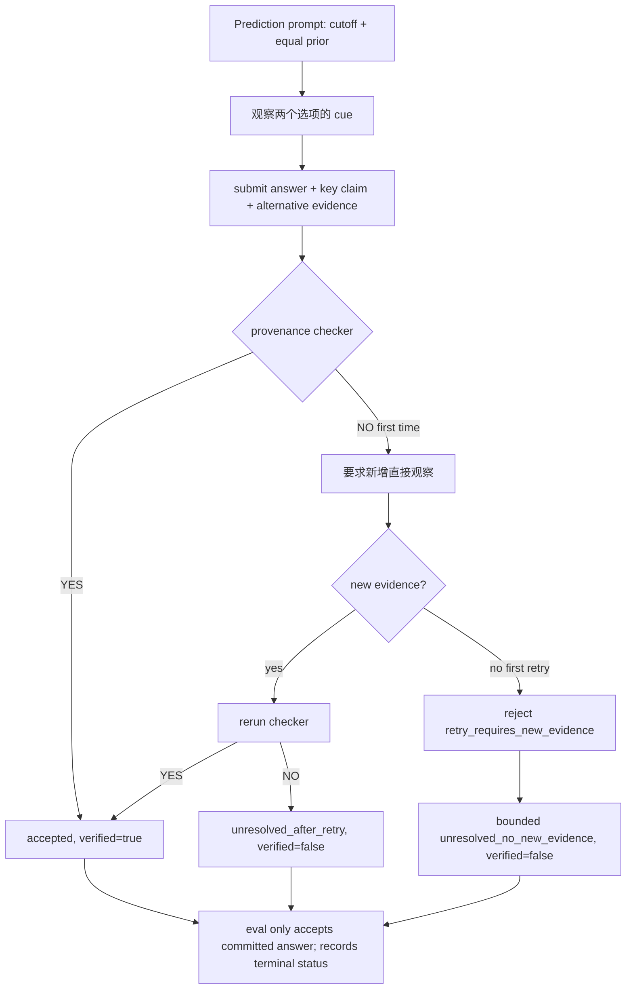

# S2.6 anti-confirmation / provenance gate 定向 smoke

- Date: 2026-08-09
- Scope: ViSTR-Bench public dev，仅运行原始 S2.6 已出现错误的 #1/#9/#269/#817；未访问 private eval
- Model: qwen3-vl-8b-thinking，vLLM GPU 0–3 TP=4，`:8001`，`max_model_len=65536`
- Perception: GroundingDINO，GPU 6，`:7876`
- Final status: 基础设施回归通过；Basketball 语义 Yes 偏置未消除；dev403 全量 HOLD

## 目标与通过条件

本轮不是用 4 题估算 accuracy，而是回答两个 sanity 问题：

1. 仓库 prompt/schema/tool contract 是否诱导模型把 Prediction 的未来结果写成已观察事实？
2. closure checker 是否真的改变回答，还是第一次拒绝后无条件放行并制造“已验证”假象？

门禁分成两层：

- 基础设施通过：提交包含对立证据；NO 后新增观察并重新检查；仍未闭合必须
  `verified=false`；tool/provider/context error 为 0。
- 行为通过：反转选项展示、强化 cutoff prompt 和 semantic localization warning 后，不再
  在明显未见 outcome 的题上稳定声称“已看到进球”。

## 执行计划

1. 停止正在写入旧语义的 dev403 进程，保留精确边界和服务。
2. 审计旧全量与当前部分输出，量化 submit 接受/拒绝、answer flip 和 Basketball Yes 倾向。
3. 先写回归测试，再修改 prompt、submit schema、retry gate、semantic_crop 契约和答案选择。
4. 运行离线全套测试。
5. 用原始失败题执行三轮、逐步加约束的 smoke；不运行全量。
6. 记录基础设施与行为质量两个独立结论，更新 ADR/code map/handoff。

## 运行边界与旧结果 sanity check

待跑全量文件
`outputs/predictions/pi_s26_qwen3-vl-8b-thinking_vllm_gpu0-3_64k_bugfix2_dev403_20260809.jsonl`
在发现偏置后停止于 47 行（Basketball 37 + Billiards 10）。其预测 Yes 43 / No 2 /
None 2，GT No 25 / Yes 22，正确 21/47；首 submit 为 Yes 44 / No 1，最终只翻转
1 次。78 次 submit 中保留了修复前的 `oneshot_bypass=32`，因此该文件是混合前语义的
诊断 artifact，禁止 `--resume`、覆盖或正式计分。

历史完整 S2.6
`outputs/predictions/pi_s26_qwen3-vl-8b-thinking_vllm_gpu01_dev403_20260808.jsonl`
显示 checker 的最终改答作用较小：335 个 submit 样本首次准确 180，最终准确 183，净增
3 题；118 个重提只翻转 25 次（16 修对、9 修错）。Basketball 的 35 个 submit 中
33 个首次答 Yes，35 个都把 outcome 写成观察事实；10 个重提答案翻转为 0。

## 修改内容

### Prompt 与选项展示

- `agent/eval_pi_agentic.py` 增加 equal-prior / counterevidence 纪律。
- Prediction 明确视频在所问结果前截断；只能使用截止前的位置、速度、轨迹和几何，不能把
  未见未来 outcome 写成事实。
- S2.6 二元选项按样本 ID 奇偶确定性反转展示；解析与评分仍使用原始语义标签。

### submit_answer 与 checker

- `alternative_evidence` 改为必填，要求给出另一选项最强的直接可见 cue。
- `key_claim` schema 移除“ball passes through hoop”正向示例，禁止把未见 outcome 当事实。
- checker 定位为 provenance/epistemic auditor，明确它看不到像素、不能根据时间覆盖或
  semantic query 推出动作/关系真值。
- 第一次 NO 后必须新增观察并真正重跑 checker；第二次仍 NO 只以
  `unresolved_after_retry, verified=false` 终止。
- 没有新增观察的立即重提先返回 `retry_requires_new_evidence`；再次空重提才有界终止为
  `unresolved_no_new_evidence, verified=false`。
- eval 中被拒 submit 或裸 `FINAL` 不能绕过 gate；合法 FINAL 必须与 accepted submit 一致。
- 首次接受后若再次 submit 且答案不同，返回
  `answer_change_after_accept_rejected`，保留原 committed answer。

### semantic_crop

- target 只允许简单物体/名词短语，不允许 passing-through/inside/touching 等关系假设。
- 结果和 details 始终声明 GroundingDINO score 只做定位，不能验证 action/relation/
  containment/contact/outcome。

## Smoke 命令

公共环境变量：

```bash
VISTR_PI_PROVIDER=vllm-local VISTR_PI_MODEL=qwen3-vl-8b-thinking \
VISTR_CAPTION_PROVIDER=vllm-local VISTR_CAPTION_MODEL=qwen3-vl-8b-thinking \
VISTR_PI_EXTENSION=agent/pi_ext/vistr_video_tools.ts,agent/pi_ext/evidence_closure.ts
```

三轮均使用 `--split dev --workers 1 --timeout 900`，并分别写入：

```bash
/opt/conda/bin/python -u agent/eval_pi_agentic.py --split dev \
  --ids 1,9,269,817 --workers 1 --timeout 900 \
  --output outputs/predictions/pi_s26_antibias_smoke_ids_1_9_269_817_20260809.jsonl

/opt/conda/bin/python -u agent/eval_pi_agentic.py --split dev \
  --ids 1,9,269,817 --workers 1 --timeout 900 \
  --output outputs/predictions/pi_s26_antibias2_smoke_ids_1_9_269_817_20260809.jsonl

/opt/conda/bin/python -u agent/eval_pi_agentic.py --split dev \
  --ids 1,9 --workers 1 --timeout 900 \
  --output outputs/predictions/pi_s26_antibias3_smoke_ids_1_9_20260809.jsonl
```

第二轮加入强化 prediction cutoff 与 `No / Yes` 反转展示；第三轮再加入
semantic_crop localization-only schema/result warning。每轮使用新文件，未续跑前一轮。

## 结果

| Run | GT | Pred | Accuracy | checker | 终态 kinds | Answer flips | Infra errors |
|-----|----|------|----------|---------|------------|--------------|--------------|
| antibias | No,No,No,Yes | Yes×4 | 1/4 | NO×6 | unresolved_after_retry×2；unresolved_no_new_evidence×2 | 0 | 0 |
| antibias2 | No,No,No,Yes | Yes×4 | 1/4 | NO×7 | unresolved_after_retry×3；retry_requires_new_evidence×1；unresolved_no_new_evidence×1 | 0 | 0 |
| antibias3 | No,No | Yes×2 | 0/2 | NO×4 | unresolved_after_retry×2 | 0 | 0 |

三轮所有 submit 都有 `alternative_evidence`，tool/provider error 均为 0。第二、三轮展示
顺序为 `No / Yes`，仍输出语义 Yes，说明本组不是 first-option bias。第三轮 warning 已进入
真实工具结果，checker 对 #1/#9 的首次和重试 claim 均为 NO；模型仍没有翻转答案。

人工检查 #1/#9 的末段 montage：最后可见帧里球仍位于篮筐上方/前方，没有直接可见的
穿网结果。模型 claim “ball passes through/inside the net”与像素不符，属于关系/结果幻觉。

## 离线回归

| 检查 | 结果 |
|------|------|
| `node agent/pi_ext/tests/run.mjs` | 98/98 passed |
| `/opt/conda/bin/python agent/tests/test_eval_pi_parse.py` | 24/24 passed |
| `/opt/conda/bin/python -m py_compile agent/eval_pi_agentic.py` | passed |
| `git diff --check` | passed |

## 结论与全量边界

基础设施目标达到：旧 one-shot fake closure 已删除，checker NO 会触发真实重检查，仍未闭合
会明确保存为 `verified=false`；语义定位 query 不再可被契约解释为关系证据。

行为目标未达到：qwen3-vl-8b-thinking 在这些 Basketball Prediction 题上仍稳定输出 Yes，
prompt 约束无法可靠覆盖模型的语义确认偏置。不能把 unresolved 强制改成 No，因为“证据未闭合”
不等于“No 为真”，那会制造反向偏置。

因此：

- 当前 47 行文件永不续跑；
- dev403 全量保持 HOLD，除非负责人明确选择“测量当前未解决偏置的实现”；
- 若未来授权全量，必须从新文件开始，同时报告 Yes/No 分布、answer flip、
  `terminal_verified`、`terminal_closure` 和 unresolved 比例，不能只报 accuracy。

服务留存供复查：vLLM GPU 0–3 `:8001`，perception GPU 6 `:7876`；本轮未调整窗口，
因为没有 context error。窗口升级只解决上下文容量，不会解决语义偏置。

收尾只读检查：vLLM `/health` 正常且 models endpoint 报
`qwen3-vl-8b-thinking/max_model_len=65536`；perception `/health` 为
`grounding-dino=loaded`；GPU 0–3 各约 21.8 GiB、GPU 6 约 4.7 GiB；没有
`eval_pi_agentic.py` 进程；中断文件仍精确为 47 行。

## Human Review Guide



核心伪代码：

```text
submit(answer, key_claim, alternative_evidence):
    require counterevidence
    if retry and no new observation:
        reject once; repeated retry -> terminal unresolved(false)
    verdict = provenance_checker(ledger, claim, alternative)
    if verdict == YES: accept(verified=true)
    if first NO: request new observation
    if retry NO: accept terminal answer only as unresolved(verified=false)

eval_answer:
    accepted = last submit with details.accepted == true
    FINAL is valid only when it matches accepted.answer
    persist terminal_verified and terminal_closure
```

代码入口：

- `agent/eval_pi_agentic.py`: `_ordered_options`, `_build_prompt`, `_select_answer`, `_closure_summary`
- `agent/pi_ext/evidence_closure.ts`: `submit_answer` schema、retry state、checker prompt
- `agent/pi_ext/vistr_video_tools.ts`: `semantic_crop` schema/result warning
- 永久 code map: `docs/code_maps/systems/pi_observation_stack.md`
