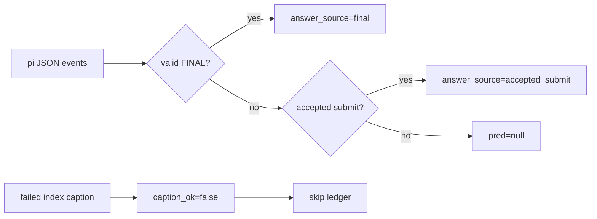

# S2.6 bugfix + GPU 0–3 64k 定向 smoke

- Date: 2026-08-09 20:04–20:31 +08:00
- Scope: public dev 原 S2.6 失败题；未运行 dev403 全量，未访问 private eval
- Output: `outputs/predictions/pi_s26_fix_smoke_ids_114_118_229_332_863_866_909_20260809.jsonl`

## 修复内容

1. thinking subcall 的 `content=null` 与 reasoning 分槽；index/semantic crop 优雅失败，
   selection budget 8→128、caption budget 1000→1500。
2. 失败的 `index_video` 增加 `caption_ok=false`，不得写入 evidence ledger。
3. eval 保存 tool result details 和 provider termination；S2.6 优先级为
   `valid FINAL > last accepted submit > pred=null`，不再使用 reasoning fallback。
4. `read_crop` 拦截 0-1 bbox，并明确固定 bbox 不是移动目标 tracker。
5. vLLM 改为 GPU 0–3 TP=4、65536；pi 对齐 `contextWindow=65536`，保持
   `maxTokens=32768`，设置 `compaction.reserveTokens=32768`。

closure 的 claim→answer 蕴含、对象一致性和时空覆盖未改，留作独立实验。

## 测试与部署

| 检查 | 结果 |
|------|------|
| Node extension suite | 93/93 passed |
| Python parser suite | 21/21 passed |
| `py_compile` / `git diff --check` | passed |
| vLLM bare-JSON serving patch | 6/6 passed |
| vLLM endpoint | :8001，模型报告 `max_model_len=65536` |
| GPU | vLLM 仅 GPU 0–3；perception 仅 GPU 6 |
| perception | :7876，GroundingDINO loaded |

外部配置：

- `~/.pi/agent/models.json` 已备份为
  `~/.pi/agent/models.json.s26-64k-20260809.bak`，两者均为 0600。
- 原 `~/.pi/agent/settings.json` 不存在；本轮新增 0600 文件，只含
  `compaction.reserveTokens=32768`。

## Smoke 命令

```bash
VISTR_PI_PROVIDER=vllm-local VISTR_PI_MODEL=qwen3-vl-8b-thinking \
VISTR_CAPTION_PROVIDER=vllm-local VISTR_CAPTION_MODEL=qwen3-vl-8b-thinking \
VISTR_PI_EXTENSION=agent/pi_ext/vistr_video_tools.ts,agent/pi_ext/evidence_closure.ts \
/opt/conda/bin/python -u agent/eval_pi_agentic.py --split dev \
  --ids 118,229,332,866,909,863,114 --workers 1 --timeout 900 \
  --output outputs/predictions/pi_s26_fix_smoke_ids_114_118_229_332_863_866_909_20260809.jsonl
```

## 结果

| ID | pred / GT | source | tools | tool errors | provider errors | elapsed |
|----|-----------|--------|-------|-------------|-----------------|---------|
| 229 | Back-right / Back-right | final | 6/6 | 0 | 0 | 178.7s |
| 863 | Front-right / Front-right | final | 5/5 | 0 | 0 | 97.5s |
| 866 | Back-left / Front-right | final | 7/7 | 0 | 0 | 150.7s |
| 909 | Back-right / Back-right | final | 10/10 | 0 | 0 | 258.4s |
| 114 | Green / Blue | final | 11/11 | 0 | 0 | 186.6s |
| 118 | Blue / Blue | final | 8/8 | 0 | 0 | 200.0s |
| 332 | Green / Blue | final | 15/15 | 0 | 0 | 314.2s |

汇总：7/7 唯一目标题完成，准确率 4/7（57.1%，非 smoke 门禁），62/62 工具真实
执行，0 tool error，0 provider error，0 null crash，vLLM/perception/eval 日志中 0 context
400。所有题 `stop_reason=stop`、`no_answer=false`。

#332 本次模型提交 Green：第一次拒绝、第二次 accepted Green，随后正常 `FINAL: Green`；
这不是旧的 answer-recovery bug。旧历史形态（accepted Blue、无 FINAL、reasoning 末尾
Green）由 Python 确定性测试验证必须输出 Blue。

## Human Review Guide

概念变化：thinking 不再冒充 committed content；S2.6 的答案恢复只信任显式 FINAL 或
accepted submit，并把 provider 终止状态变成可审计输出。



```text
parse events -> preserve tool details + termination
if S2.6:
    labeled option -> final
    else last accepted submit argument -> committed answer
    else -> no answer
```

关键指针：`agent/eval_pi_agentic.py::_parse_pi_json/_select_answer`、
`agent/pi_ext/vistr_video_tools.ts::parseChatReply/read_crop/index_video`、
`agent/pi_ext/evidence_closure.ts::mapEvent`。已更新 code map：
`docs/code_maps/systems/pi_observation_stack.md`。

## 结束状态

- `vllm-64k` 保留运行：GPU 0–3、:8001、日志 `/tmp/vllm_gpu0-3_64k.log`。
- `perception-s26` 保留运行：GPU 6、:7876、日志 `/tmp/perception_s26_64k.log`。
- dev403 全量交给 Claude Code，见
  `docs/working_logs/handoffs/2026-08-09_s26_bugfix_64k_dev403_claude.md`。
