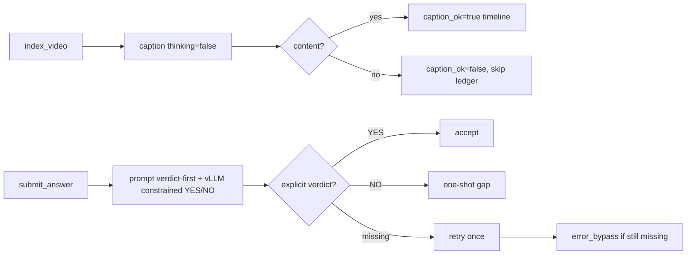

# S2.6 caption/checker bugfix 定向 smoke

- Date: 2026-08-09 21:47–22:00 +08:00
- Scope: public dev 原错误题 #26/#31/#783；未运行 dev403 全量，未访问 private eval
- Service: qwen3-vl-8b-thinking，GPU 0–3 TP=4，`max_model_len=65536`，:8001
- Perception: GroundingDINO，GPU 6，:7876

## 修复

1. `index_video` caption 子调用关闭 thinking，避免 1500-token 预算被思考块吃完。
2. checker prompt 要求裁决先行；本地 vLLM 使用 assistant prefill `CLOSURE: ` 和
   `structured_outputs.choice=[YES,NO]`，只生成受约束的二分类结果。
3. 只有显式 NO 才拒绝；空、截断或不可解析回复重试一次，仍失败则记录
   `error_bypass`，不得伪判 NO。
4. checker 完整回复、finish reason、attempts 从 tool details 进入 JSONL closure 汇总。

## 离线门禁

| 检查 | 结果 |
|------|------|
| Node extension suite | 94/94 passed |
| Python parser suite | 22/22 passed |
| `py_compile` / `git diff --check` | passed |
| vLLM bare-JSON serving patch | 6/6 passed |

## Smoke 命令

公共环境变量：

```bash
VISTR_PI_PROVIDER=vllm-local VISTR_PI_MODEL=qwen3-vl-8b-thinking \
VISTR_CAPTION_PROVIDER=vllm-local VISTR_CAPTION_MODEL=qwen3-vl-8b-thinking \
VISTR_PI_EXTENSION=agent/pi_ext/vistr_video_tools.ts,agent/pi_ext/evidence_closure.ts
```

先运行原错误题：

```bash
/opt/conda/bin/python -u agent/eval_pi_agentic.py --split dev \
  --ids 26,31,783 --workers 1 --timeout 900 \
  --output outputs/predictions/pi_s26_fix2_smoke_ids_26_31_783_20260809.jsonl
```

这一步确认 caption 已修复，但也形成了重要反例：仅把 checker 预算从 2048 提至
4096 仍不够。#31 连续两次 `finish_reason=length`，正确进入 `error_bypass`，没有再
伪判 NO。加入 prompt + prefill + constrained choice 后，以新文件重跑 #31：

```bash
/opt/conda/bin/python -u agent/eval_pi_agentic.py --split dev \
  --ids 31 --workers 1 --timeout 900 \
  --output outputs/predictions/pi_s26_fix2_smoke_retry_id31_constrained_20260809.jsonl
```

两个输出均保留：前者是 4096 仍失败的诊断证据，后者是最终实现的通过证据。

## 最终结果

| ID | 历史错误 | 最终 caption | 最终 checker | tools | provider/tool error | elapsed |
|----|----------|--------------|--------------|-------|---------------------|---------|
| 783 | caption-only thinking + checker 截断 | `caption_ok=true` | YES / stop / 1 attempt | 6/6 | 0/0 | 69.2s |
| 26 | caption-only thinking + checker 截断 | `caption_ok=true` | YES / stop / 1 attempt | 12/12 | 0/0 | 149.7s |
| 31 | checker 截断 | `caption_ok=true` | YES / stop / 1 attempt（约束版） | 9/9 | 0/0 | 98.8s |

三题最终均无 caption-no-answer、checker length、error_bypass、null crash 或 context 400。
准确率 0/3，仅反映模型答案质量，不是 smoke 门禁。

## 4 卡上下文结论

当前启动日志显示 GPU KV cache 容量 364,000 tokens：65536 下最大并发约 5.55。
本轮所有 smoke 均无 context 400，因此不重启服务、不提高 `max_model_len`。若 Claude
全量后续出现主会话 context error，再按 handoff 依次试 98304/workers=3 和
131072/workers=2；checker 截断不能靠扩大模型总窗口解决。

## Human Review Guide



关键代码：`captionTimeline`、`evidenceClosure/submit_answer`、`_closure_summary`。
永久 code map：`docs/code_maps/systems/pi_observation_stack.md`。
