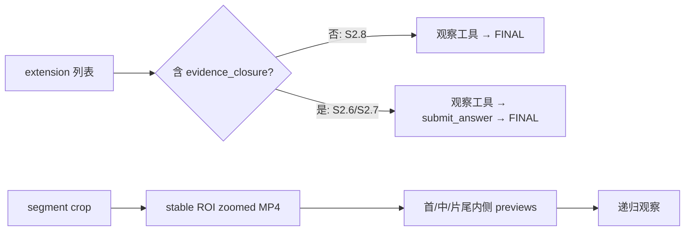

# S2.8 × qwen3-vl-8b-thinking vLLM 96k smoke

- Date: 2026-08-10 21:13–21:20 +08:00
- Scope: ViSTR-Bench public dev 定向工具探针 + IDs 1/114/229；未访问 private split，未运行 dev403 全量
- Model: `qwen3-vl-8b-thinking`，vLLM GPU 0–3 TP=4，`:8001`，`max_model_len=98304`
- Perception: GroundingDINO，GPU 6，`:7876`
- Output: `outputs/predictions/pi_s28_qwen3-vl-8b-thinking_vllm_gpu0-3_96k_smoke_ids_1_114_229_20260810.jsonl`

## 适配内容

1. S2.8 只加载 `vistr_video_tools.ts` 时，prompt 不再要求不存在的 `submit_answer`；
   加载 evidence closure 的旧路径仍保留 submit protocol。
2. zoomed clip 的最后一张 preview 从精确片尾移到片尾内侧，避免 ffmpeg seek 无帧。
3. `time_s` 与 `start_s+end_s` 严格互斥，时段参数必须成对、有限且正序。
4. 新增 `configs/vllm_qwen3_vl_8b_thinking_gpu0-3_96k.json`，与当前服务参数一致。

contextual ROI（60% expansion + 25% minimum extent）、三时间点 grounding、temporal
union 和整段 stable ROI 均未改变。

## 离线门禁

| 检查 | 结果 |
|------|------|
| Node extension suite | 98/98 passed |
| Python parser/prompt suite | 23/23 passed |
| `py_compile` | passed |
| 96k launcher `--dry-run` | passed；GPU 0–3、TP=4、98304、Hermes/Qwen3 parser 正确 |
| `git diff --check` | passed |

## 真实视频段探针

第一次直接调用未注入 eval 的 PATH，两个工具返回 `spawn ffprobe ENOENT`；第二次 PATH
设置过窄，选到系统旧 Node 并在 pi 启动时退出。二者均未进入有效工具逻辑。按
`eval_pi_agentic.agent_env()` 等价方式保留现有 Node PATH、前置 ffmpeg/cv2 路径后重跑：

- `semantic_crop(video.mp4, "the basketball", 0.2s, 2.0s)`：3 个采样点成功
  grounding 2 个，stable ROI `[495,645,975,915]` / 1920×1080。
- 输出 `zoomed_the_basketball_0.2s_2.0s.mp4`：H.264、480×270、1.8s。
- 下一轮 `read_video_sequence(..., 0–1.5s, 3 frames)` 成功，times=`[0,0.75,1.5]`。
- 2/2 工具调用 `isError=false`，最终 `FINAL: probe_pass`。

Session：`~/.pi/agent/sessions/--tmp-s28_vllm_live_probe_20260810--/2026-08-10T13-15-09-092Z_019febd0-0fa4-7e1d-a767-b68315ec0161.jsonl`。

## Benchmark smoke

```bash
VISTR_PI_PROVIDER=vllm-local VISTR_PI_MODEL=qwen3-vl-8b-thinking \
VISTR_CAPTION_PROVIDER=vllm-local VISTR_CAPTION_MODEL=qwen3-vl-8b-thinking \
VISTR_PI_EXTENSION=agent/pi_ext/vistr_video_tools.ts \
/opt/conda/bin/python -u agent/eval_pi_agentic.py --split dev \
  --ids 1,114,229 --workers 1 --timeout 900 \
  --output outputs/predictions/pi_s28_qwen3-vl-8b-thinking_vllm_gpu0-3_96k_smoke_ids_1_114_229_20260810.jsonl
```

| ID | Task | pred / GT | source | tools | errors | elapsed |
|----|------|-----------|--------|-------|--------|---------|
| 1 | Basketball_Shot | Yes / No | final | 3/3 | 0 | 31.4s |
| 229 | Ego_Motion | Back-right / Back-right | final | 3/3 | 0 | 65.9s |
| 114 | Relative_Velocity | Green / Blue | final | 8/8 | 0 | 94.2s |

汇总：3/3 唯一题完成，1/3 accuracy（非 smoke 门禁），14/14 工具真实执行，0 tool
error、0 provider error、0 no-answer、0 context 400、0 `submit_answer`。所有题均
`answer_source=final`、`stop_reason=stop`。主 agent 实际使用了 index/sequence/
multiframe；视频段 crop 的 live 能力由上面的定向探针覆盖。

## Human Review Guide

概念变化：S2.8 的回答协议现在与实际加载工具一致；视频段观察仍使用原 stable ROI
算法，只修复片尾 preview 和非法参数行为。



```text
validate exactly one of time_s or start_s+end_s
if segment:
    keep existing grounding -> temporal union -> contextual ROI -> crop
    preview at start, midpoint, and just before EOF
build prompt from loaded extensions; mention submit only when the tool exists
```

关键指针：`agent/eval_pi_agentic.py::_build_prompt/solve_agentic`、
`agent/pi_ext/vistr_video_tools.ts::segmentPreviewTimes/semantic_crop/read_crop`。
已更新 code map：`docs/code_maps/systems/pi_observation_stack.md`。

## 结束状态

- vLLM `vllm-96k` 保留运行（GPU 0–3、`:8001`、98304）。
- perception `perception-s26` 保留运行（GPU 6、`:7876`）。
- dev403 全量交接：`docs/working_logs/handoffs/2026-08-10_s28_qwen3_vl_8b_96k_dev403_claude.md`。
