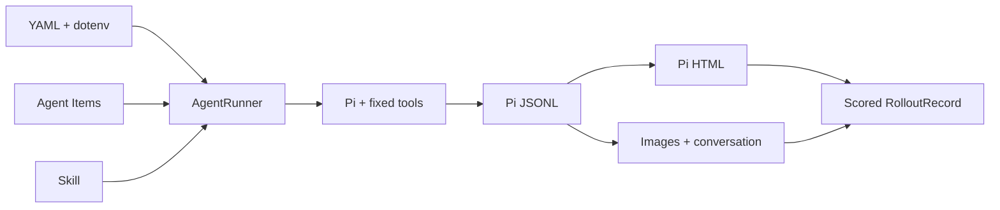

# Configurable S2.8 runtime implementation

## Goal

Keep only the current S2.8 flow in the supported runtime, move user-selected runtime values to YAML and API connection values to its dotenv, encapsulate Pi/service/workspace internals, and persist every attempt as native Pi and SkillOpt-ready artifacts.

## Changes

- Added strict configuration and public Python contracts under `agent/runtime/`, plus the ViSTR adapter under `agent/datasets/`.
- Added the closed `s2_8_observation` Tool Bundle: Pi `read/bash/edit/write` plus the five existing video tools.
- Removed the observation extension's dependency on `~/.pi/agent/models.json`; Observer settings now arrive from the runner.
- Added managed/eager perception lifecycle, per-item retries, run manifests, safe resume, Pi-native HTML export, image materialization, compact conversations, and `hard`/`soft` scoring.
- Added `configs/agent/s2_8.yaml`, `.env.example`, and the initial evolvable Skill.
- Standardized the active Policy prompt, evolvable Skill, and Observer subcall prompts on English; retained Chinese only in the legacy-answer parser compatibility path.
- Changed the active answer contract to `<answer>exact option text</answer>` and added tag-priority extraction coverage, including case-insensitive multiline tags.
- Kept V4 and closure/ledger code as legacy; the active Node gate now covers only S2.8 video tools.

Security review found that environment-referenced provider keys would be inherited by Pi's model-callable `bash`. The runtime instead places selected credentials in a temporary mode-0600 Pi config, removes their source variables from the child environment, and has the extension capture then remove Observer credentials before the agent loop.

## Verification

```text
/opt/conda/bin/python agent/tests/test_runtime.py
13 tests passed

/opt/conda/bin/python agent/tests/test_eval_pi_parse.py
21 checks passed

node agent/pi_ext/tests/run.mjs
31/31 passed

/opt/conda/bin/python -m compileall -q agent/runtime agent/datasets agent/tests/test_runtime.py
passed

git diff --check
passed
```

No provider call, GPU service, model load, or benchmark evaluation was run.

## Human Review Guide

Conceptually, configuration and artifacts now surround a fixed S2.8 Pi harness; only the natural-language Skill varies between rollouts.



```text
load and validate config
enter runner; reuse or start perception
for each item and attempt: run Pi in a temporary workspace
export all sessions; decode images; write reflection conversation
score the selected attempt; append results
close only owned resources
```

Key pointers: `AgentConfig.from_yaml`, `AgentRunner.rollout`, `export_and_materialize`, `ViSTRAdapter.load`, and `gatewayConfig`. Permanent maps updated: `docs/code_maps/systems/configurable_agent_runtime.md` and `docs/code_maps/systems/pi_observation_stack.md`.
