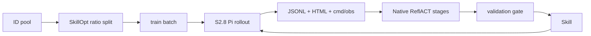

# Native SkillOpt ViSTR integration and smoke

## Goal

Run `/workspace/Spatial-Agent/SkillOpt`'s native update loop around the current
S2.8 `AgentRunner`, inherit the DocVQA training recipe, and accept a user-defined
ViSTR Public ID pool that is deterministically split with the generic SkillOpt
ratio loader.

## Changes

- Added `agent.skillopt` as a thin bootstrap, loader, and environment adapter;
  the upstream `ReflACTTrainer` remains the only training-loop implementation.
- Added a profile inheriting `SkillOpt/configs/docvqa/default.yaml`, pinned the
  external checkout to commit `db46cd9`, and made the optimizer inherit the
  S2.8 policy's DeepSeek provider/model/dotenv.
- Added a checked-in 670-ID Public pool. SkillOpt's `2:1:7`, seed-42 splitter
  generated 134 train, 67 validation, and 469 test items.
- Added ViSTR-specific English failure/success analyst prompts while preserving
  SkillOpt's patch protocol and native merge/ranking/gate/slow/meta stages.
- Added `cmd/obs` to canonical tool events so native fast and slow reflection
  can see tools; existing trajectory fields remain available.
- Kept optimizer secrets out of Pi's model-callable child environment and
  verified that output artifacts contain no configured secret value.

## Verification

```text
/opt/conda/bin/python agent/tests/test_skillopt_bridge.py
6/6 passed, including a fake native ReflACT accept path

/opt/conda/bin/python agent/tests/test_runtime.py
13/13 passed

/opt/conda/bin/python agent/tests/test_eval_pi_parse.py
21/21 passed

node agent/pi_ext/tests/run.mjs
33/33 passed

/opt/conda/bin/python -m compileall -q agent/skillopt agent/runtime
passed

git diff --check
passed
```

## Real one-step smoke

Command:

```bash
/opt/conda/bin/python -u -m agent.skillopt \
  --config configs/skillopt/vistr_docvqa.yaml \
  --smoke
```

Resolved runtime:

- DeepSeek `deepseek-v4-flash-vision-exp` for the Pi policy and SkillOpt
  optimizer, with independent calls and contexts.
- One epoch and one update step; two loaded train items, one validation item;
  final test, slow update, and meta skill disabled only for the smoke.
- Training IDs 82 and 286; validation ID 145. ID 286 timed out once at 600
  seconds and succeeded on attempt 2. All five Pi attempts produced native HTML.

Observed result:

```text
baseline validation hard: 1.0
training hard:            0.0 (0/2)
reflection patches:       1
candidate validation:     1.0
gate action:              reject (strict improvement required)
best step:                0 (initial Skill)
wall time:                1674.4 s
optimizer calls/tokens:   1 / 37,707
```

The patch correctly used the new ViSTR schema and classified the paired
failures as tracking/motion, reasoning, and tool-strategy errors. The candidate
Skill grew from 1,272 to 2,364 characters but was rejected because it tied the
initial Skill on validation. Secret scan across the SkillOpt output and all
native smoke trajectories found zero hits.

Repeating the same command loaded `runtime_state.json`, resumed from step 2,
skipped the already completed one-step loop, made zero model calls, and finished
in under one second without adding an Attempt.

Outputs:

- `outputs/skillopt/vistr_docvqa_smoke/`
- native rollout directories under `outputs/trajectories/skillopt-*`

## Human review guide

The S2.8 target harness is unchanged; the new layer converts a selected ID pool
to SkillOpt batches and converts scored Pi artifacts back to the native
reflection contract.



```text
validate pinned SkillOpt checkout
load S2.8 YAML and selected dotenv
materialize or verify the deterministic split
run each SkillOpt batch through AgentRunner
write reflection projections pointing to native trajectories
let ReflACT persist patches, gates, versions, resume state, and scores
```

Key pointers: `agent.skillopt.cli._bootstrap`,
`agent.skillopt.integration.ViSTRSkillOptDataLoader`,
`ViSTRSkillOptAdapter.rollout`, and
`agent.runtime.artifacts._session_to_conversation`. Permanent map:
`docs/code_maps/systems/skillopt_vistr_training.md`.
