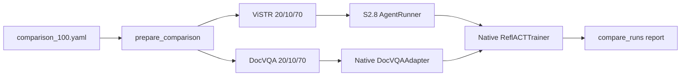

# SkillOpt ViSTR versus DocVQA comparison preparation and smokes

## Goal

Prepare a single-seed, equal-budget system comparison between the native 4D
ViSTR agent and SkillOpt's DocVQA agent. This task implements and smokes the
experiment; it does not launch either 100-item formal run.

## Fixed experiment

- Sample seed and split seed: 43.
- Per benchmark: 100 total, split into 20 train, 10 validation, and 70 test.
- ViSTR: uniform Public sampling; all 100 questions are binary and the sample
  covers all 15 tasks.
- DocVQA: sampled from SkillOpt's released 534-ID validation pool; all 100
  questions have gold answers and distinct image paths.
- Training: four epochs, batch size 5, 16 Fast Update Steps, native DocVQA
  reflection/merge/gate/slow/meta settings, and cosine edit budgets
  `4,4,4,4,4,3,3,3,3,3,2,2,2,2,2,2`.
- Both conditions inherit `deepseek-v4-flash-vision-exp` from `s2_8.yaml` for
  target and optimizer. Each system retains its native agent and seed Skill.

The primary metric counts only Fast gate actions `accept` and
`accept_new_best`. Slow `force_accept` actions are reported separately. This is
a system-level correlation pilot, not a causal test of outcome false positives.

## Data preparation

Command:

```bash
/opt/conda/bin/python -u -m agent.skillopt.prepare_comparison \
  --config configs/skillopt/comparison_100.yaml
```

Observed result:

```text
ViSTR:  100 items, 15 tasks
DocVQA: 100 items, 100 unique images, all with answers
Both:   train=20, val=10, test=70
```

The manifest and materialized DocVQA images/splits are under
`data/skillopt_comparison/seed43/`. The manifest pins source hashes, selected
IDs, split membership, distributions, and SkillOpt commit `db46cd9`.

## Real paired smokes

Commands:

```bash
/opt/conda/bin/python -u -m agent.skillopt \
  --config configs/skillopt/vistr_comparison_100.yaml --smoke
/opt/conda/bin/python -u -m agent.skillopt \
  --config configs/skillopt/docvqa_comparison_100.yaml --smoke
```

Each smoke used two train, two validation, and two test items but disabled final
test, slow update, and meta skill. Both attempted one Fast Update Step.

| Metric | ViSTR | DocVQA |
|---|---:|---:|
| Train hard | 1/2 | 2/2 |
| Non-empty patch / candidate steps | 1 / 1 | 1 / 1 |
| Candidate edits | 2 | 1 |
| Validation, baseline → candidate | 1.0 → 1.0 | 1.0 → 1.0 |
| Gate action | reject | reject |
| Effective Updates | 0/1 | 0/1 |
| Target failures | 1 | 0 |
| Timeout attempts | 3 | 0 |
| SkillOpt calls / tokens | 2 / 37,089 | 5 / 4,962 |
| Wall time | 2,011.4 s | 9.1 s |

The paired report is in
`outputs/skillopt/comparison_seed43/smoke_report/`. A one-step smoke is only a
pipeline check; its equal update count is not an experimental result.

### ViSTR timeout diagnosis

Training item 980 (`Mikado_Dependency`) exhausted all three 600-second
attempts without emitting `<answer>`. Attempts 1 and 2 made respectively 110
and 121 tool calls. Approximate timestamp attribution was:

| Attempt | Total | Model response wait | Tool execution | Model turns |
|---|---:|---:|---:|---:|
| 1 | 593 s | 537 s | 56 s | 92 |
| 2 | 592 s | 555 s | 37 s | 96 |

The trace repeatedly varied crops and locally generated frames while revisiting
target-stick identity. No individual tool exceeded about four seconds. The
failure is therefore non-convergent observation/reasoning, not a slow tool or a
stalled process. Per user decision, `timeout_s: 600` and `max_attempts: 3`
remain unchanged.

## Resume and artifact checks

Repeating both smoke commands resumed after step 1, made zero model calls, and
added no rollout attempts. During this check, upstream SkillOpt was found to
rewrite `summary.json` with zero usage on a no-op resume. The integration now
preserves the prior summary whenever history gains no step, and the reporter
can recover baseline and per-step usage from immutable artifacts. The repaired
behavior was verified by a unit test and a second no-op resume.

All ViSTR attempts rendered native HTML. A scan for the configured policy key
found zero hits across paired SkillOpt outputs and native trajectories.

## Verification

```text
agent/tests/test_skillopt_comparison.py  7/7 passed
agent/tests/test_skillopt_bridge.py      6/6 passed
agent/tests/test_runtime.py              13/13 passed
agent/tests/test_eval_pi_parse.py        21/21 passed
agent/pi_ext/tests/run.mjs               33/33 passed
compileall + git diff --check            passed
```

## Human review guide



Review `comparison_manifest.json` first, then the two resolved configs and
`history.json` files. The implementation seams are
`agent.skillopt.prepare_comparison.prepare`,
`agent.skillopt.integration.run_training`, and
`agent.skillopt.compare_runs.compare`.
